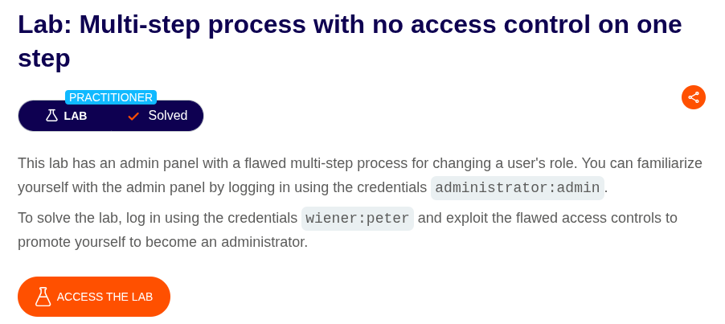
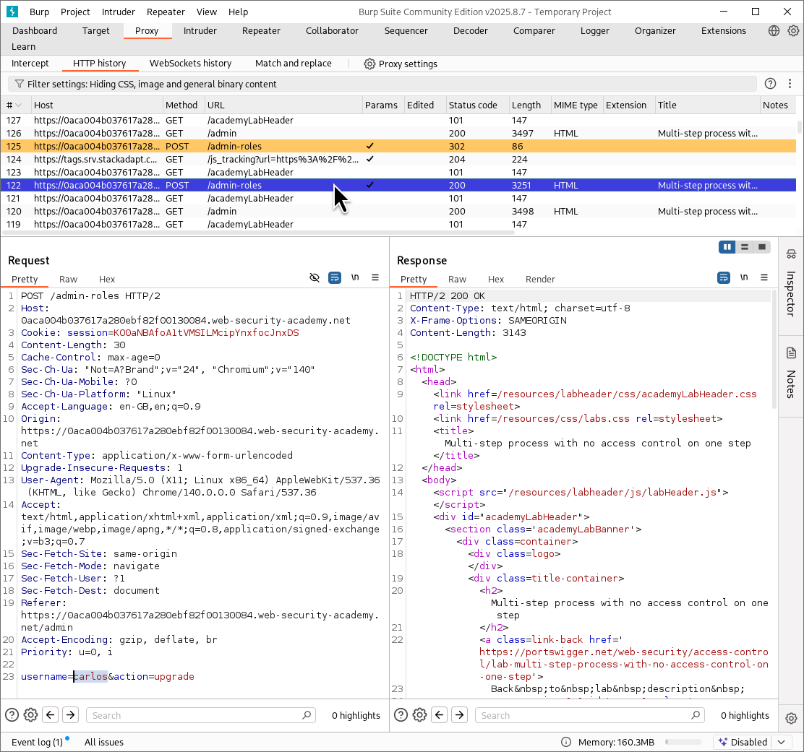
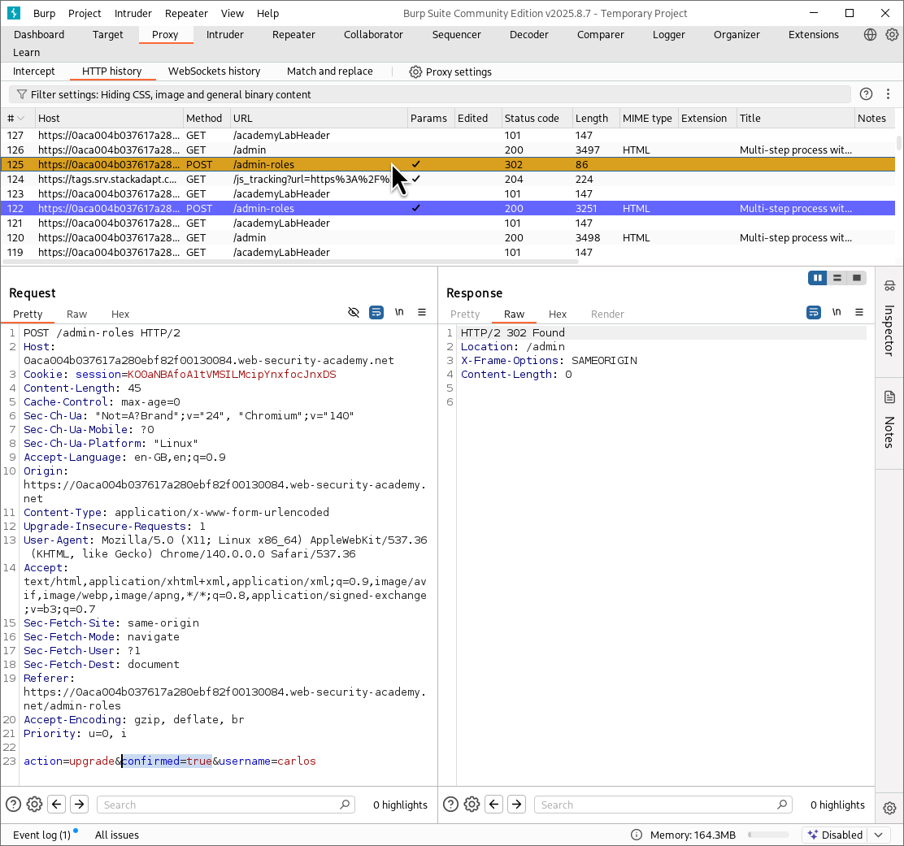
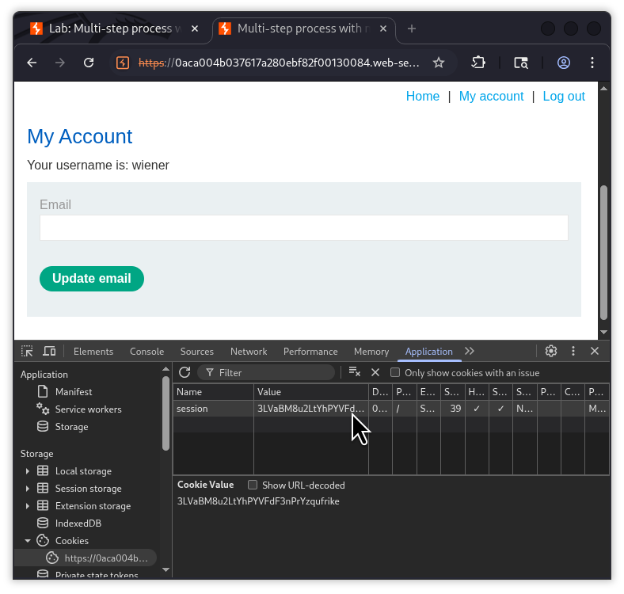
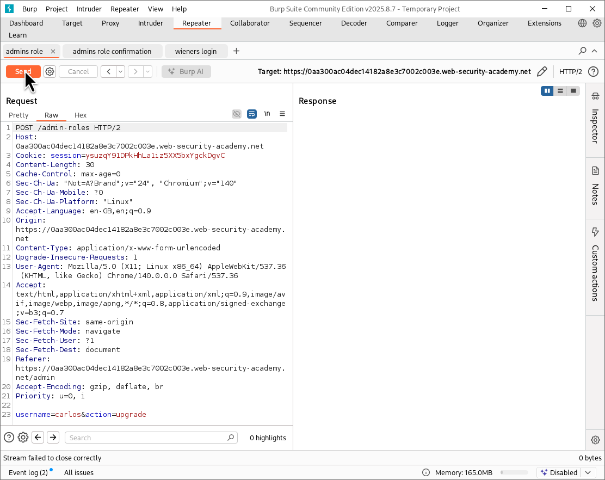
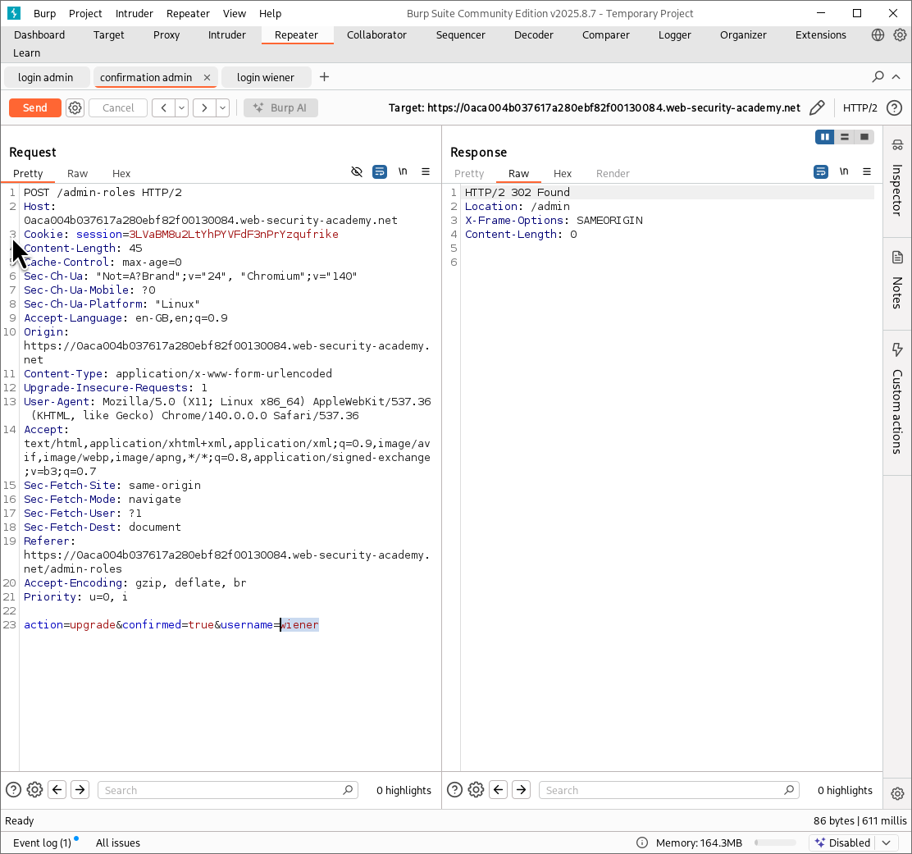
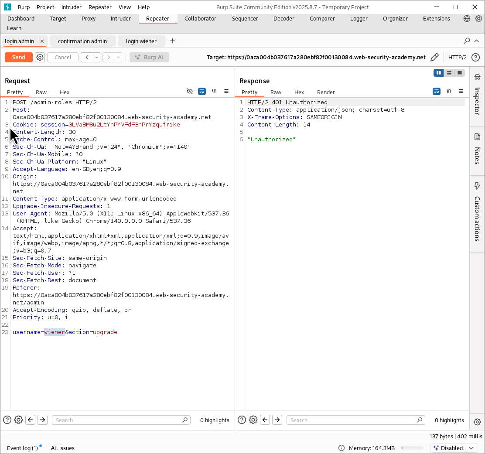
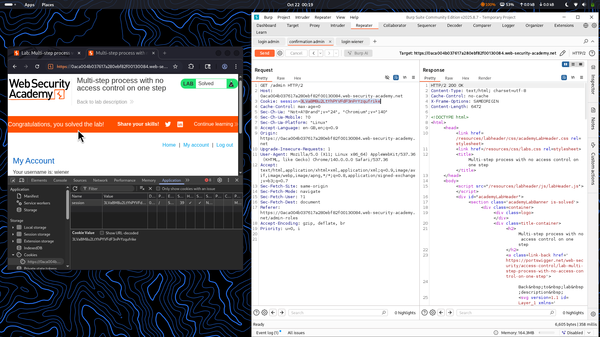

⚠️ **DISCLAIMER / EDUCATIONAL PURPOSES ONLY**  
The information, methodologies, and techniques documented in this write-up are intended solely for educational, training, and authorized security testing purposes. This analysis was conducted within a strictly controlled, legally authorized simulation environment provided by the PortSwigger Web Security Academy. Unauthorized testing, manipulation, or exploitation of live, production web applications without explicit prior consent from the system owner is illegal and punishable under cyber crime laws (including the Information Technology Act in India). The author assumes no liability for the misuse of this information.***  

# Lab Write-Up: Multi-step Process with No Access Control on One Step  

### Portfolio Information  
* **Author:** Ayushma M  
* **Main Repository:** [github.com/ayushmam81-ui/Web-Application-Security-Portfolio](https://github.com/ayushmam81-ui/Web-Application-Security-Portfolio)  
* **Direct File Link:** [labs/access-control-lab5.md](https://github.com/ayushmam81-ui/Web-Application-Security-Portfolio/blob/main/labs/access-control-lab5.md)  

---

### 1. Target & Scenario  
* **Platform:** PortSwigger Web Security Academy  
* **Vulnerability Class:** Flawed Multi-Step Process / Broken Access Control  
* **Objective:** This lab features an admin panel with a flawed multi-step process for changing a user's role. To solve the lab, log in using the credentials `wiener:peter` and exploit the flawed access controls to promote yourself to become an administrator. You can familiarize yourself with the admin panel first using the credentials `administrator:admin`.  

---

### 2. Analysis & Methodology  

#### Step 1: Reconnaissance via Administrator Account  
* Logged into the application using the administrator credentials (`administrator:admin`) to inspect the multi-step upgrade workflow.  
* Promoted a test user (`carlos`) to observe the sequence of requests generated by the admin interface:  
  1. Initial role-change request (`POST /admin-roles` with parameters `username=carlos&action=upgrade`).  
  2. Confirmation prompt request (`POST /admin-roles` with parameters `action=upgrade&confirmed=true&username=carlos`).  

#### Step 2: Session Token Extraction  
* Logged out of the admin account, signed in as the standard user (`wiener:peter`), and extracted the valid session cookie value from the browser's developer tools (`Inspect → Application → Cookies`).  

#### Step 3: Replicating the Workflow in Burp Repeater  
* Captured the initial role-upgrade request and sent it to Burp Repeater, replacing the session cookie with `wiener`'s session token and targeting `carlos`.  
* Captured the subsequent confirmation request (`action=upgrade&confirmed=true`) in Burp Repeater. Modified the target username parameter from `carlos` to `wiener` and updated the session cookie with `wiener`'s session token.  

#### Step 4: Exploitation & Solution Verification  
* Sent the modified confirmation request. The application processed the final step without verifying whether the low-privileged user session was authorized to execute the confirmation.  
* Followed the redirection response to verify administrative privileges, successfully displaying the lab solved notification banner.  

---

### 3. Visual Evidence  

#### Lab Execution and Output:  
  
*Figure 1: Lab description detailing the flawed multi-step role change mechanism.*  

  
*Figure 2: The initial POST request sent by the website when initiating a user role upgrade.*  

  
*Figure 3: The subsequent request sent after confirming the user upgrade action.*  

  
*Figure 4: Locating and copying the session cookie value from browser application storage.*  

  
*Figure 5: Preparing the role-upgrade request inside Burp Repeater.*  

  
*Figure 6: Editing the confirmation request parameters and session cookie to target `wiener`.*  

  
*Figure 7: Verifying intermediate response behavior during request testing.*  

  
*Figure 8: Successfully bypassing access controls to achieve administrator status and solve the lab.*  

---

### 4. Remediation Strategy  
To secure multi-step operational workflows against broken access control:  
1. **Consistent Session Validation:** Enforce rigorous, server-side access control validation across **every** individual step of a multi-step workflow, rather than trusting that a user completed preceding authenticated checks securely.  
2. **Context-Aware Authorization:** Ensure that sensitive role-modification actions explicitly bind the user session's privilege level to the specific state parameter changes throughout the entire sequence.
