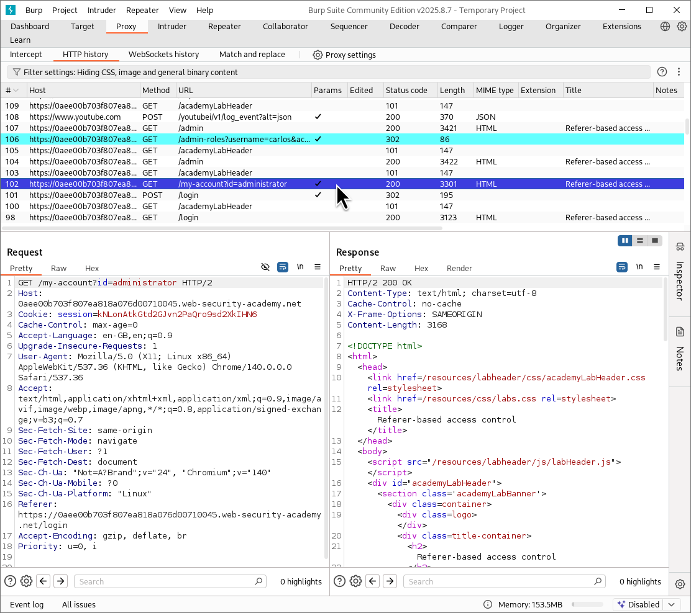
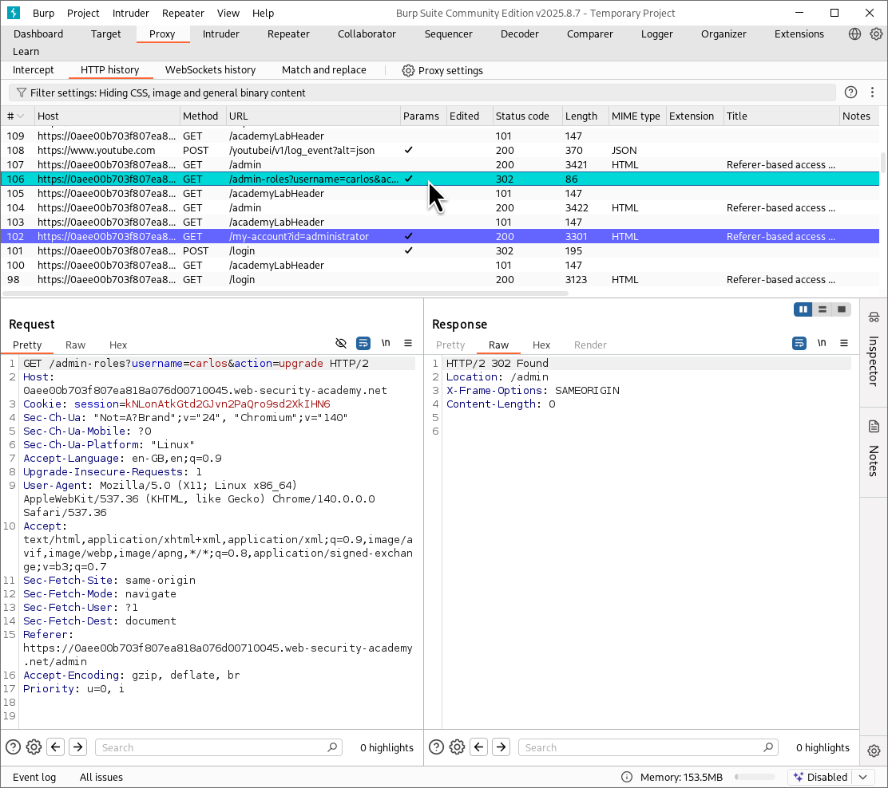
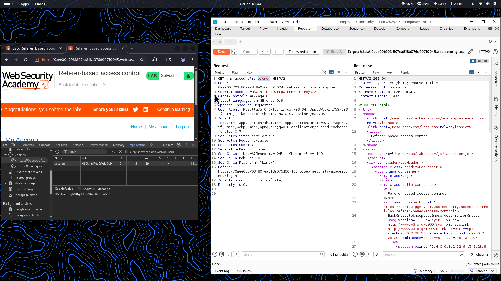
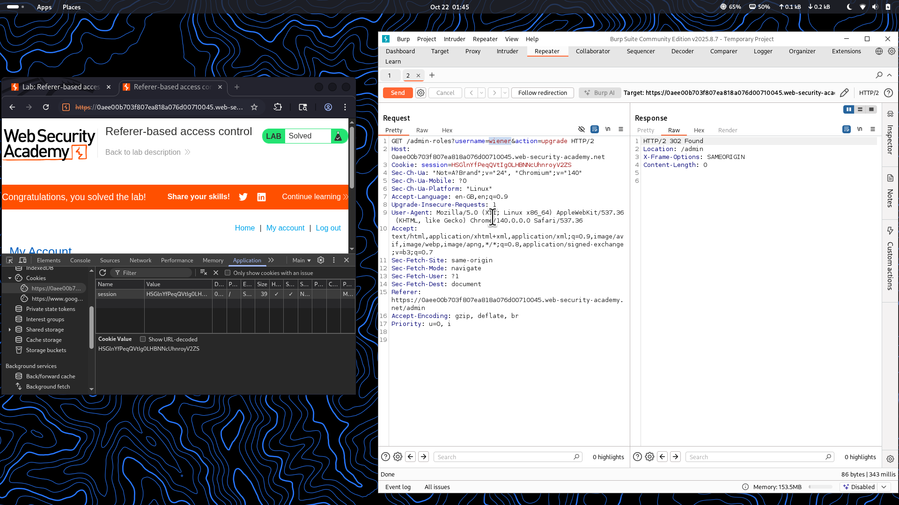

⚠️ **DISCLAIMER / EDUCATIONAL PURPOSES ONLY**  
The information, methodologies, and techniques documented in this write-up are intended solely for educational, training, and authorized security testing purposes. This analysis was conducted within a strictly controlled, legally authorized simulation environment provided by the PortSwigger Web Security Academy. Unauthorized testing, manipulation, or exploitation of live, production web applications without explicit prior consent from the system owner is illegal and punishable under cyber crime laws (including the Information Technology Act in India). The author assumes no liability for the misuse of this information.

---

# Lab Write-Up: Referer-Based Access Control  

### Portfolio Information  
* **Author:** Ayushma M  
* **Main Repository:** [github.com/ayushmam81-ui/Web-Application-Security-Portfolio](https://github.com/ayushmam81-ui/Web-Application-Security-Portfolio)  
* **Direct File Link:** [labs/access-control-lab6.md](https://github.com/ayushmam81-ui/Web-Application-Security-Portfolio/blob/main/labs/access-control-lab6.md)  

---

### 1. Target & Scenario  
* **Platform:** PortSwigger Web Security Academy  
* **Vulnerability Class:** Referer-Based Access Control / Broken Access Control  
* **Objective:** The lab features administrative functionality dependent on the `Referer` header for access control validation. To solve the lab, log in using the credentials `wiener:peter` and exploit the weak access controls to promote yourself to become an administrator.  

---

### 2. Analysis & Methodology  

#### Step 1: Examining Administrative Functionality  
* Logged into the application and observed how administrative actions (such as upgrading user roles via `/admin-roles`) are structured.  
* Noted that the application mistakenly relies on the HTTP `Referer` header to determine whether a request originated from an administrative context, rather than validating the user's actual session privileges server-side.  

#### Step 2: Replicating and Modifying Requests in Repeater  
* Captured the standard user account or role upgrade request and sent it to Burp Repeater.  
* Injected an administrative URL path into the `Referer` header of the request while using the low-privileged session token of `wiener`.  

#### Step 3: Privilege Escalation and Verification  
* Sent the modified request containing the forged `Referer` header. The application incorrectly granted authorization based on the header value.  
* Refreshed the user profile or followed redirections to confirm that the standard user account (`wiener`) was successfully upgraded to administrator status, solving the lab.  

---

### 3. Visual Evidence  

#### Lab Execution and Output:  
  
*Figure 1: Inspecting administrative login flows and request history.*  

  
*Figure 2: Observing the role upgrade request structure in proxy history.*  

  
*Figure 3: Editing session cookies and parameters inside Burp Repeater.*  

  
*Figure 4: Successfully exploiting referer-based restrictions to achieve lab completion.*  

---

### 4. Remediation Strategy  
To secure applications against referer-based access control flaws:  
1. **Never Rely on the Referer Header:** Treat HTTP `Referer` headers as user-controllable input that can be easily spoofed; they should never be used as the primary mechanism for authorization or access control decisions.  
2. **Robust Session-Based Authorization:** Enforce strict, session-based role checks on the server side for all sensitive endpoints to ensure only genuinely authenticated and authorized administrative users can execute privileged actions.
