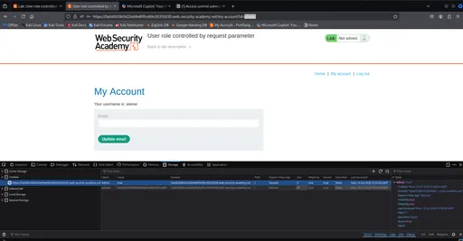
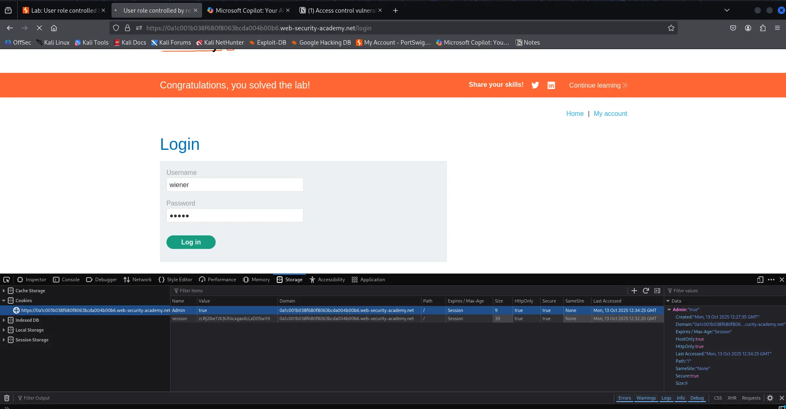
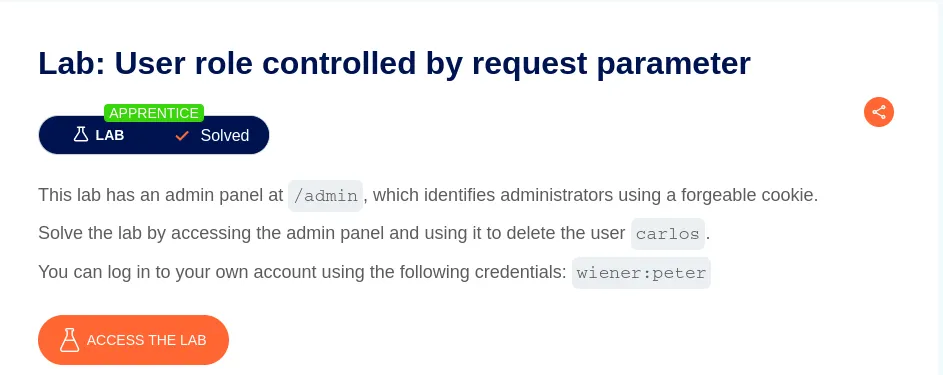

⚠️ **DISCLAIMER / EDUCATIONAL PURPOSES ONLY**
The information, methodologies, and techniques documented in this write-up are intended solely for educational, training, and authorized security testing purposes. This analysis was conducted within a strictly controlled, legally authorized simulation environment provided by the PortSwigger Web Security Academy. Unauthorized testing, manipulation, or exploitation of live, production web applications without explicit prior consent from the system owner is illegal and punishable under cyber crime laws (including the Information Technology Act in India). The author assumes no liability for the misuse of this information.

***

# Lab Write-Up: Admin Privilege from Cookies

### Portfolio Information
* **Author:** Ayushma M
* **Main Repository:** [github.com/ayushmam81-ui/Web-Application-Security-Portfolio](https://github.com/ayushmam81-ui/Web-Application-Security-Portfolio)
* **Direct File Link:** [labs/admin-privilege-cookies.md](https://github.com/ayushmam81-ui/Web-Application-Security-Portfolio/blob/main/labs/admin-privilege-cookies.md)

---

### 1. Target & Scenario
* **Platform:** PortSwigger Web Security Academy[cite: 7]
* **Vulnerability Class:** Parameter-based Access Control Methods / Cookie Manipulation[cite: 7]
* **Objective:** This lab has an admin panel at `/admin`, which identifies administrators using a forgeable cookie. Solve the lab by accessing the admin panel and using it to delete the user `carlos`. You can log in to your own account using the following credentials: `wiener:peter`.

---

### 2. Analysis & Methodology

#### Step 1: Authentication & Reconnaissance
* Logged into the application using the provided credentials (`wiener:peter`).
* Inspected the application storage to identify where user roles or states are tracked client-side.

#### Step 2: Cookie Modification & Privilege Escalation
* Cookies will be found under the storage tab—cookies tab and edit the value of admin as true[cite: 7].
* This step makes `wiener` as the admin—type `admin` instead of `wiener` in the URL (or navigate to `/admin`) to bypass authorization checks[cite: 7].

#### Step 3: Execution
* Accessed the unlocked administrator interface and successfully deleted target user `carlos` to solve the lab.

---

### 3. Visual Evidence

#### Lab Execution and Output:

*Figure 1: Cookies will be found under storage tab—cookies tab and edit the value of admin as true[cite: 7].*

*Figure 2: This step makes wiener as the admin—type admin instead of wiener in the URL[cite: 7].*

*Figure 3: Lab successfully solved by deleting user carlos[cite: 7].*

---

### 4. Remediation Strategy
To secure the application against parameter-based access control flaws:
1. **Server-Side Role Management:** Keep user roles and privileges strictly on the server side within a secure, validated session rather than relying on client-accessible cookies or parameters[cite: 7].
2. **Enforce Authorization Checks:** Validate user permissions on every incoming request to ensure clients cannot escalate privileges by altering local state variables[cite: 7].
