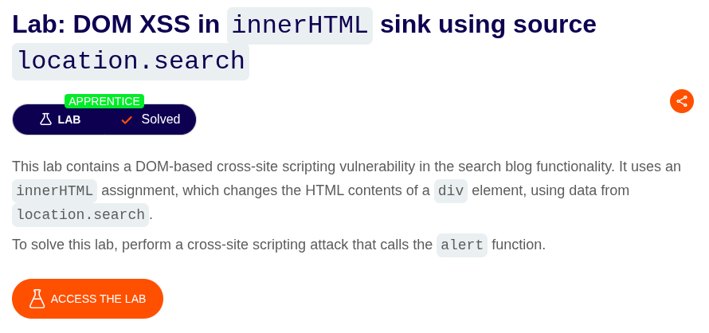
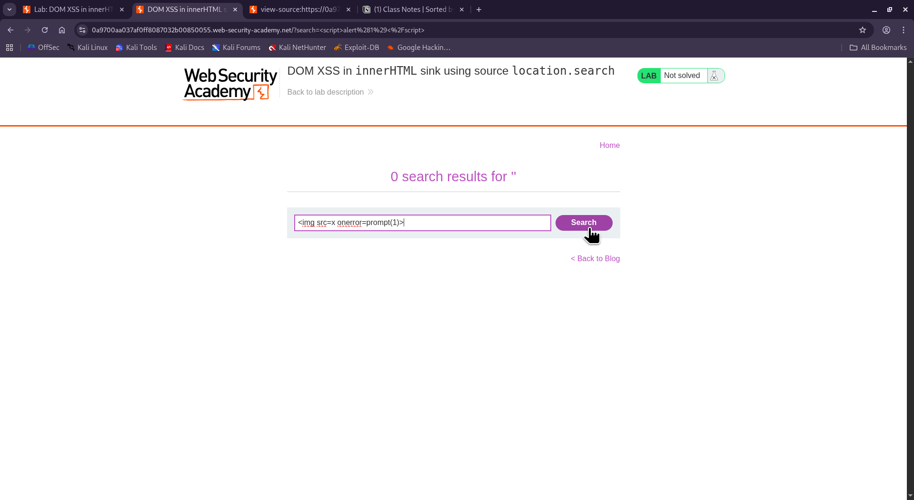
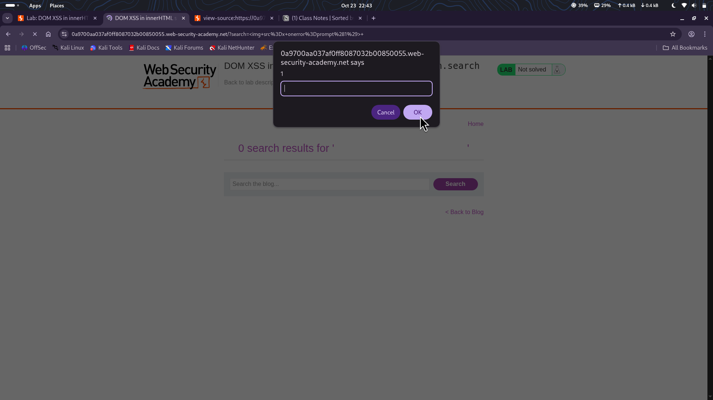

⚠️ **DISCLAIMER / EDUCATIONAL PURPOSES ONLY**
The information, methodologies, and techniques documented in this write-up are intended solely for educational, training, and authorized security testing purposes. This analysis was conducted within a strictly controlled, legally authorized simulation environment provided by the PortSwigger Web Security Academy. Unauthorized testing, manipulation, or exploitation of live, production web applications without explicit prior consent from the system owner is illegal and punishable under cyber crime laws (including the Information Technology Act in India). The author assumes no liability for the misuse of this information.

***

# Lab Write-Up: DOM XSS in innerHTML sink using source location.search

### Portfolio Information
* **Author:** Ayushma M
* **Main Repository:** [github.com/ayushmam81-ui/Web-Application-Security-Portfolio](https://github.com/ayushmam81-ui/Web-Application-Security-Portfolio)
* **Direct File Link:** [labs/dom-xss-innerhtml.md](https://github.com/ayushmam81-ui/Web-Application-Security-Portfolio/blob/main/labs/dom-xss-innerhtml.md)

---

### 1. Target & Scenario
* **Platform:** PortSwigger Web Security Academy
* **Vulnerability Class:** DOM-based Cross-Site Scripting (DOM XSS)
* **Objective:** Perform a cross-site scripting attack that calls the alert function.

---

### 2. Analysis & Methodology

#### Step 1: Initial Assessment & Identification of Constraints
I reviewed the lab parameters which state it contains a DOM-based cross-site scripting vulnerability in the search blog functionality. It uses an `innerHTML` assignment, which changes the HTML contents of a `div` element, using data from `location.search`. Crucially, `document.getElementById().innerHTML` doesn't execute the tags: `script` & `svg`.

#### Step 2: Intercepting and Analyzing the HTTP Traffic
To bypass this restriction and execute javascript execution natively within the browser application, we need to inject an alternative HTML element that triggers code execution via a different vector than standard scripts.

#### Step 3: Manipulation & Successful Exploitation
Here we clicked on the searched bar and typed the command `` and this opened a pop-up screen. The payload utilizes an invalid image source (`src=x`) to force an error condition, directly firing the `onerror` event handler to display the popup box and solve the lab challenge.

---

### 3. Visual Evidence

#### Lab Objective Context:

*Figure 1: The initial challenge parameters outlining the innerHTML sink and location.search source target.*

#### Error Triggered by Server Balance Check:

*Figure 2: Submitting the alternative element-handler payload directly into the active search submission panel.*

#### Parameter Modification in Burp Repeater:

*Figure 3: The browser execution revealing the active web-security-academy platform pop-up prompt input window on screen.*

---

### 4. Remediation Strategy
To secure this transaction sequence, the developer must stop relying on client-side inputs for static variables:
1. **Implement Server-Side Validation:** Avoid passing direct input variables into dangerous front-end sinks like `innerHTML`.
2. **Discard Client-Sent Pricing Data:** Shift to secure alternative APIs like `textContent` or use context-aware output encoding to handle raw strings safely.
