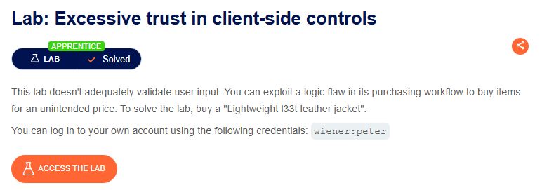
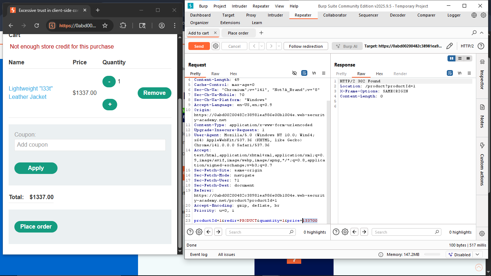
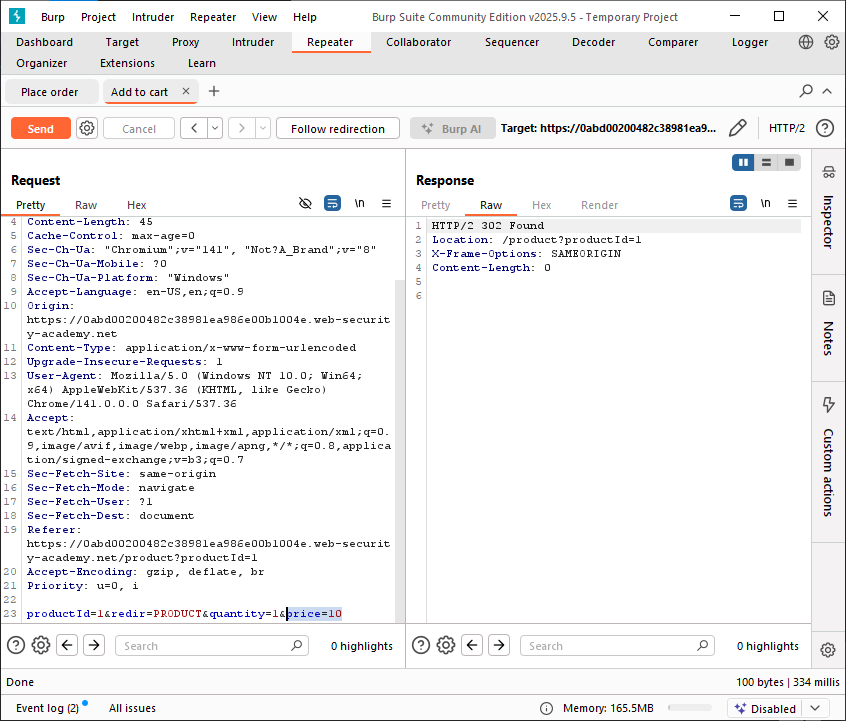

⚠️ **DISCLAIMER / EDUCATIONAL PURPOSES ONLY**
The information, methodologies, and techniques documented in this write-up are intended solely for educational, training, and authorized security testing purposes. This analysis was conducted within a strictly controlled, legally authorized simulation environment provided by the PortSwigger Web Security Academy. Unauthorized testing, manipulation, or exploitation of live, production web applications without explicit prior consent from the system owner is illegal and punishable under cyber crime laws (including the Information Technology Act in India). The author assumes no liability for the misuse of this information.[cite: 3]

***

# Lab Write-Up: Excessive Trust in Client-Side Controls[cite: 3]

### Portfolio Information
* **Author:** Ayushma M[cite: 3]
* **Main Repository:** [github.com/ayushmam81-ui/Web-Application-Security-Portfolio](https://github.com/ayushmam81-ui/Web-Application-Security-Portfolio)[cite: 3]
* **Direct File Link:** [labs/excessive-trust-client-controls.md](https://github.com/ayushmam81-ui/Web-Application-Security-Portfolio/blob/main/labs/excessive-trust-client-controls.md)[cite: 3]

---

### 1. Target & Scenario
* **Platform:** PortSwigger Web Security Academy[cite: 3]
* **Vulnerability Class:** Business Logic Vulnerability / Parameter Tampering[cite: 3]
* **Objective:** Exploit a flaw in the application's purchasing workflow to buy a "Lightweight l33t leather jacket" for an unintended, lower price.[cite: 3]

---

### 2. Analysis & Methodology

#### Step 1: Initial Assessment & Identification of Constraints
I authenticated into the e-commerce store using the provided credentials. The target item, a "Lightweight l33t leather jacket", was priced at $1337.00[cite: 3]. Attempting to purchase or add the item to the cart normally triggered an error indicating **"Not enough store credit for this purchase"**, confirming the application enforces a strict financial check based on user balance[cite: 3].

#### Step 2: Intercepting and Analyzing the HTTP Traffic
To inspect how the pricing structure was processed, I initiated a request to add the item to the cart and intercepted the transmission using **Burp Suite Community Edition**[cite: 3]. I sent the resulting payload to **Burp Repeater** for detailed analysis[cite: 3]. 

The application passed critical parameters directly through the message body of a POST request to /cart[cite: 3]:

`productId=1&redir=PRODUCT&quantity=1&price=133700`[cite: 3]

This revealed a fundamental design flaw: the application relies entirely on client-side controls to declare the value of an item, rather than managing the cost safely on the backend server[cite: 3].

#### Step 3: Manipulation & Successful Exploitation
Using Burp Repeater, I tampered with the parameters[cite: 3]. I modified the `price` parameter value from `133700` directly down to `10` (manipulating the transaction price down to $0.10)[cite: 3]. 

Upon clicking **Send**, the server processed the parameter without validating it against a secure master database[cite: 3]. The application responded with an HTTP 302 Found status, redirecting back to the product catalog and successfully placing the high-value item into the cart for pennies, solving the lab[cite: 3].

---

### 3. Visual Evidence

#### Lab Objective Context:

*Figure 1: The initial challenge parameters requiring the purchase of the leather jacket.*

#### Error Triggered by Server Balance Check:

*Figure 2: The application blocking the purchase due to a high default price.*[cite: 3]

#### Parameter Modification in Burp Repeater:

*Figure 3: Modifying the client-side price parameter down to 10 in Burp Suite.*[cite: 3]

---

### 4. Remediation Strategy
To secure this transaction sequence, the developer must stop relying on client-side inputs for static variables[cite: 3]:
1. **Implement Server-Side Validation:** Product pricing must be pulled directly from a secure, trusted relational database on the server layer using only the productId as a reference[cite: 3].
2. **Discard Client-Sent Pricing Data:** The backend application should explicitly ignore or reject any price parameters transmitted within HTTP request bodies from users[cite: 3].
