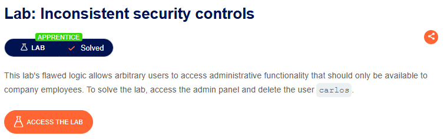
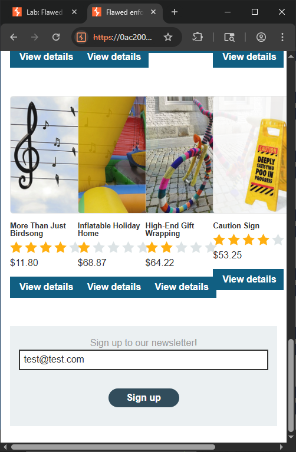
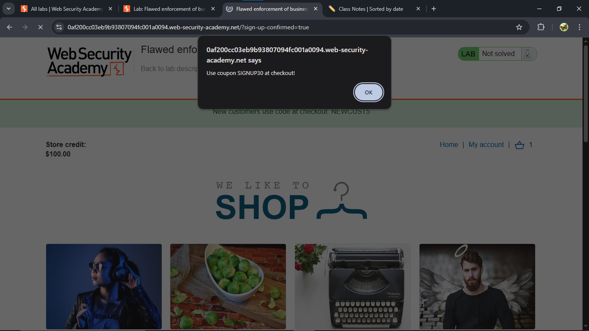
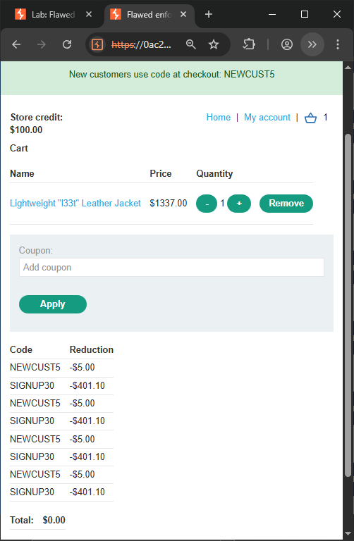

⚠️ **DISCLAIMER / EDUCATIONAL PURPOSES ONLY**
The information, methodologies, and techniques documented in this write-up are intended solely for educational, training, and authorized security testing purposes. This analysis was conducted within a strictly controlled, legally authorized simulation environment provided by the PortSwigger Web Security Academy. Unauthorized testing, manipulation, or exploitation of live, production web applications without explicit prior consent from the system owner is illegal and punishable under cyber crime laws (including the Information Technology Act in India). The author assumes no liability for the misuse of this information.

***

# Lab Write-Up: Flawed Enforcement of Business Rules

### Portfolio Information
* **Author:** Ayushma M
* **Main Repository:** [github.com/ayushmam81-ui/Web-Application-Security-Portfolio](https://github.com/ayushmam81-ui/Web-Application-Security-Portfolio)
* **Direct File Link:** [labs/flawed-enforcement-of-business-rules.md](https://github.com/ayushmam81-ui/Web-Application-Security-Portfolio/blob/main/labs/flawed-enforcement-of-business-rules.md)

---

### 1. Target & Scenario
* **Platform:** PortSwigger Web Security Academy
* **Vulnerability Class:** Business Logic Vulnerability / Flawed Enforcement of Business Rules
* **Objective:** Exploit logic vulnerabilities in the checkout validation engine to buy a high-value item ("Lightweight l33t leather jacket") using stacked discount codes that bypass single-use intent constraints.

---

### 2. Analysis & Methodology

#### Step 1: Baseline Context Gathering
I accessed the store application and identified the target product ("Lightweight l33t leather jacket") valued at $1337.00. The platform prominently featured a baseline marketing promotion banner on the interface offering a 5% discount code for new customers: `NEWCUST5`.

#### Step 2: Extracting Secondary Promotion Indicators
I navigated to the bottom of the home screen interface to map out further interaction surfaces. I discovered a newsletter signup feature. By inputting a testing email pointer (`test@test.com`) and triggering the registration logic, the platform successfully registered the parameter and triggered a front-end alert pop-up disclosing an additional hidden promotion tier code: `SIGNUP30`.

#### Step 3: Mapping Validation Layer Limitations
The application logic intended for these codes to be applied once per session profile or order checkout event. However, the validation engine did not track or enforce sequential restriction matrices properly. While it prevented a user from entering the *same* coupon code consecutively (e.g., entering `SIGNUP30` two times in a row would register a validation error), it failed to maintain a state history mapping total uses when interspersed with alternative items.

#### Step 4: Coupon Stacking & Order Settlement
I added the target leather jacket to the shopping cart array. By building an alternating execution loop—applying `NEWCUST5`, followed by `SIGNUP30`, then back to `NEWCUST5`—the backend accepted every parameter adjustment as a novel event. This logic error allowed the discount reductions to continuously stack, gradually reducing the total balance due down to exactly **$0.00**. I finalized the order checkout flow to solve the lab.

---

### 3. Visual Evidence

#### Lab Objective Context:

*Figure 1: The target challenge criteria requiring a privilege or purchase exploit strategy.*

#### Extracting Promotional Parameters:

*Figure 2: Accessing the newsletter input forms to fetch backend registration flags.*

#### Coupon Trigger Disclosure:

*Figure 3: Pop-up validation message exposing the high-value SIGNUP30 coupon identifier.*

#### Exploiting Validation State History:

*Figure 4: Interleaving promotional codes to bypass check controls and reduce total pricing to zero.*

---

### 4. Remediation Strategy
1. **State-Driven Promotion Ledgers:** Implement an absolute tracking matrix on the server side that binds an applied coupon schema directly to the customer profile or individual transaction ID, preventing any coupon from being executed more than once per checkout event.
2. **Explicit Coupon Combinatorics Validation:** Enforce definitive server-side business rules that explicitly check if secondary promotional parameters are compatible with existing cart attributes, outright rejecting coupon combinations unless explicitly allowed by market logic layers.
