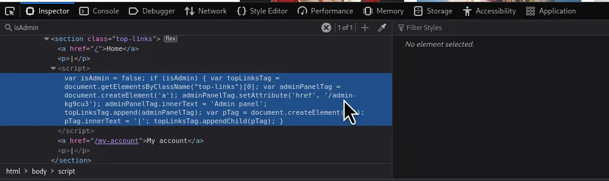
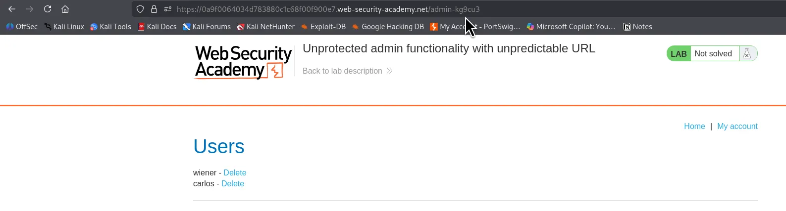
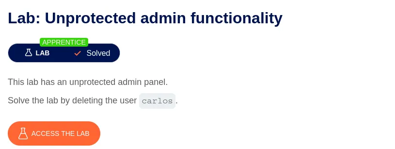

⚠️ **DISCLAIMER / EDUCATIONAL PURPOSES ONLY**
The information, methodologies, and techniques documented in this write-up are intended solely for educational, training, and authorized security testing purposes. This analysis was conducted within a strictly controlled, legally authorized simulation environment provided by the PortSwigger Web Security Academy. Unauthorized testing, manipulation, or exploitation of live, production web applications without explicit prior consent from the system owner is illegal and punishable under cyber crime laws (including the Information Technology Act in India). The author assumes no liability for the misuse of this information.

***

# Lab Write-Up: Hidden URL - Script Analysis

### Portfolio Information
* **Author:** Ayushma M
* **Main Repository:** [github.com/ayushmam81-ui/Web-Application-Security-Portfolio](https://github.com/ayushmam81-ui/Web-Application-Security-Portfolio)
* **Direct File Link:** [labs/hidden-url-script.md](https://github.com/ayushmam81-ui/Web-Application-Security-Portfolio/blob/main/labs/hidden-url-script.md)

---

### 1. Target & Scenario
* **Platform:** PortSwigger Web Security Academy[cite: 7]
* **Vulnerability Class:** Vertical Access Control / Security by Obscurity[cite: 7]
* **Objective:** Find the hidden administrative URL embedded within frontend scripts and solve the lab by deleting the user `carlos`[cite: 7].

---

### 2. Analysis & Methodology

#### Step 1: Reconnaissance & Discovery
* Clicked on inspect and searched for `isAdmin` within the page source code[cite: 7]. This is how you are supposed to find the hidden URL[cite: 7].
* Analyzed the client-side script block where the administrative link was dynamically created and assigned via JavaScript functions (e.g., `adminPanelTag.setAttribute('href', '/admin-kg9cu3')`)[cite: 7].

#### Step 2: Exploitation & Access Control Bypass
* Typed the URL found after `setAttribute` (`/admin-kg9cu3`) directly into the browser's address bar to access the administrative functionality[cite: 7].

#### Step 3: Execution
* Located target user `carlos` within the user management interface and deleted the user to successfully solve the lab[cite: 7].

---

### 3. Visual Evidence

#### Lab Execution and Output:

*Figure 1: Clicked on inspect and searched for isAdmin - This is how your supposed to find the hidden URL[cite: 7].*

*Figure 2: Typed the URL after setAttribute that was /admin-kg9cu3 and deleted carols[cite: 7].*

*Figure 3: Lab successfully solved.*

---

### 4. Remediation Strategy
To secure the application against security by obscurity vulnerabilities:
1. **Remove Sensitive Logic from Client-Side Code:** Never embed hidden administrative paths, feature flags, or sensitive endpoints inside client-side JavaScript where users can inspect them.
2. **Enforce Robust Server-Side Access Control:** Implement strict authorization checks on the server side for every administrative route rather than relying on obscure or unlinked URL structures[cite: 7].
