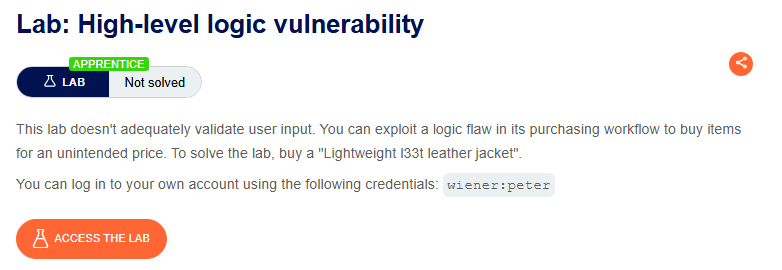

⚠️ **DISCLAIMER / EDUCATIONAL PURPOSES ONLY**
The information, methodologies, and techniques documented in this write-up are intended solely for educational, training, and authorized security testing purposes. This analysis was conducted within a strictly controlled, legally authorized simulation environment provided by the PortSwigger Web Security Academy. Unauthorized testing, manipulation, or exploitation of live, production web applications without explicit prior consent from the system owner is illegal and punishable under cyber crime laws (including the Information Technology Act in India). The author assumes no liability for the misuse of this information.

***

# Lab Write-Up: High-Level Logic Vulnerability (Boundary Value Injection)

### Portfolio Information
* **Author:** Ayushma M
* **Main Repository:** [github.com/ayushmam81-ui/Web-Application-Security-Portfolio](https://github.com/ayushmam81-ui/Web-Application-Security-Portfolio)
* **Direct File Link:** [labs/high-level-logic-vulnerabilities.md](https://github.com/ayushmam81-ui/Web-Application-Security-Portfolio/blob/main/labs/high-level-logic-vulnerabilities.md)

---

### 1. Target & Scenario
* **Platform:** PortSwigger Web Security Academy
* **Vulnerability Class:** Business Logic Vulnerability / Boundary Value Injection
* **Objective:** Exploit a flaw in the cart validation logic to purchase a high-value item (leather jacket) using a fixed store credit constraint of $100.00.

---

### 2. Analysis & Methodology

#### Step 1: Initial Assessment & Store Credit Constraints
I authenticated into the e-commerce store and noted that my account was restricted to a fixed store credit balance of $100.00. I located the target product (the jacket) specified in the lab requirements. Because the unit cost exceeded my total store credit, a standard checkout sequence was impossible, and direct price parameter tampering was thoroughly blocked or uneditable in this environment.

#### Step 2: Testing Boundary Values via Negative Quantities
To test how the application parsed numerical input constraints, I intercepted the "add to cart" request for an item using Burp Suite. Instead of passing positive integers, I injected a negative value into the quantity field. 

The application accepted the negative integer, calculating the subtotal as a negative value. This confirmed that the backend processing layer failed to perform data validation or sanity checks against numerical boundaries (imposing a minimum value restriction of >= 1).

#### Step 3: Manipulating the Cart Logic & Exploitation
While the negative subtotal successfully lowered the overall cart value, the e-commerce platform strictly prohibited finalizing an order if the grand total was a negative number (as the application would owe the customer money). 

To bypass this check, I structured a multi-item payload in the cart:
1. I added the target jacket to the cart at its standard price.
2. I injected negative quantities of secondary items to create a negative balance offset.
3. I balanced the items sequentially until the total cost fell safely above $0.00 but remained below my maximum store credit threshold of $100.00. 

Upon submitting the order, the business logic accepted the manipulated totals, completing the transaction and solving the lab.

---

### 3. Visual Evidence

#### Application Context & Target:

*Figure 1: The target scenario requiring a leather jacket purchase under fixed credit.*

#### Cart Value Manipulation Strategy:
.png)
*Figure 2: Manually inserting negative quantity strings to drive down subtotal values.*

#### Successful Exploitation & Lab Completion:
.png)
*Figure 3: Completing checkout with a valid positive balance under the $100 allocation.*

---

### 4. Remediation Strategy
1. **Strict Input Validation (Whitelisting):** The application backend must validate that all quantity parameters sent by users are strictly positive integers greater than zero before executing database and cart subtotal modifications.
2. **Server-Side Integrity Checks:** Implement an explicit state check at the server layer right before checkout to verify that individual line item prices and structural values are valid and unmanipulated.
