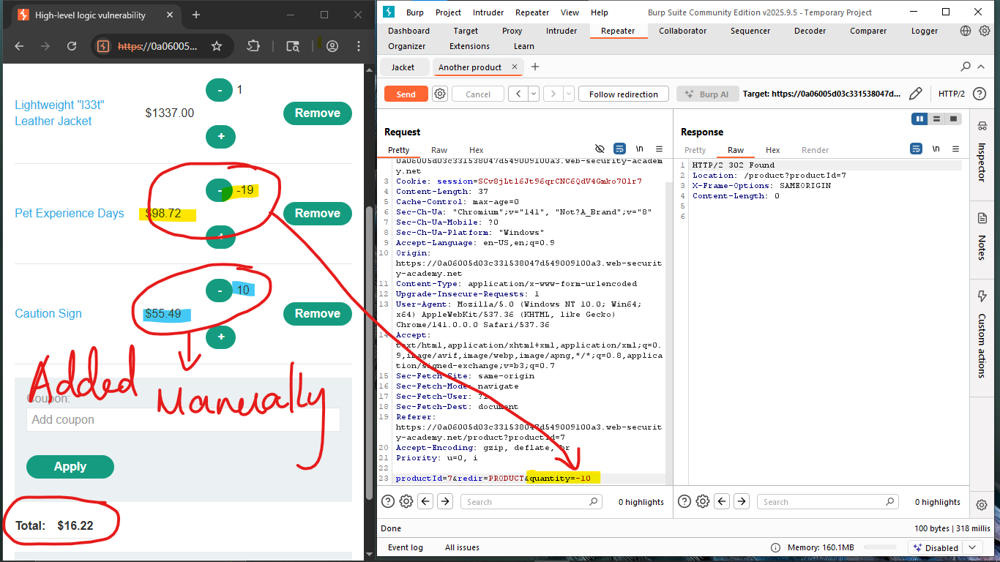
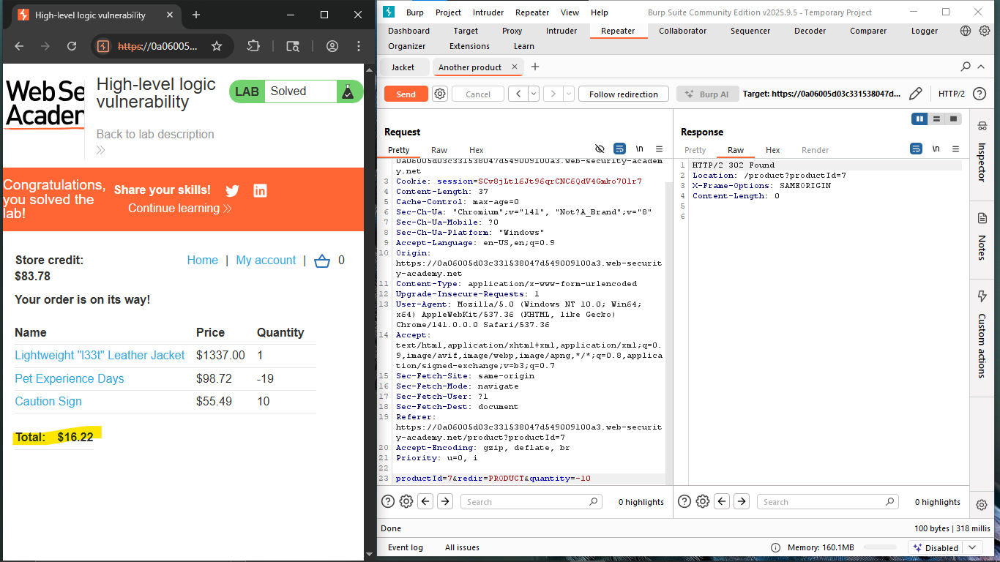

⚠️ **DISCLAIMER / EDUCATIONAL PURPOSES ONLY**
The information, methodologies, and techniques documented in this write-up are intended solely for educational, training, and authorized security testing purposes. This analysis was conducted within a strictly controlled, legally authorized simulation environment provided by the PortSwigger Web Security Academy. Unauthorized testing, manipulation, or exploitation of live, production web applications without explicit prior consent from the system owner is illegal and punishable under cyber crime laws (including the Information Technology Act in India). The author assumes no liability for the misuse of this information.

***

# Lab Write-Up: High-Level Logic Vulnerability

### Portfolio Information
* **Author:** Ayushma M
* **Main Repository:** [github.com/ayushmam81-ui/Web-Application-Security-Portfolio](https://github.com/ayushmam81-ui/Web-Application-Security-Portfolio)
* **Direct File Link:** [labs/high-level-logic-vulnerability.md](https://github.com/ayushmam81-ui/Web-Application-Security-Portfolio/blob/main/labs/high-level-logic-vulnerability.md)

---

### 1. Target & Scenario
* **Platform:** PortSwigger Web Security Academy
* **Vulnerability Class:** Business Logic Vulnerability / Flawed Input Validation
* **Objective:** Exploit flaws within the application's purchasing workflow to purchase a high-value item ("Lightweight l33t leather jacket") for an unintended price within the boundary constraints of the allocated store credit balance ($100.00).

---

### 2. Analysis & Methodology

#### Step 1: Baseline Workflow Assessment
I logged into the store application using the provided customer credentials (`wiener:peter`) and analyzed the cart submission workflow. When a user adds an item to the cart, the client sends a POST request containing application parameters like `productId` and `quantity`.

#### Step 2: Testing Parameter Boundaries
The application relies on client-side state manipulation constraints rather than validating parameters purely on the server side. To exploit this logic flaw, I added the targeted "Lightweight l33t leather jacket" ($1337.00) to the shopping cart. Since the item exceeded my total store credit balance, I intercepted the product addition request via Burp Suite and sent it over to the **Repeater** module for precise parameter tuning.

#### Step 3: Injecting Negative Value Payloads
In Burp Repeater, I manipulated the cart input behavior by supplying negative integer values inside the `quantity` parameter payload (e.g., setting `quantity=-10` or `quantity=-19` on cheaper secondary filler products like "Pet Experience Days" and "Caution Sign"). 

The server processed the negative integers literally without sanity-checking the lower mathematical boundaries of the request. Instead of throwing an error or dropping the negative values, the backend added the negative price products to the cart array. This offset the $1337.00 price tag of the jacket, driving the absolute final cart valuation down below my current store credit limit to an affordable balance of **$16.22**.

#### Step 4: Finalizing Order Checkout
Once the overall cart pricing value registered as a valid, positive amount within the boundaries of my available store credit profile, I clicked **Place Order**. The transaction finalized successfully without triggering code security errors, confirming the order delivery.

---

### 3. Visual Evidence

#### Lab Objective Context:

*Figure 1: The initial challenge parameters requiring the purchase of the leather jacket.*

#### Parameter Manipulation via Intercepted Request:

*Figure 2: Intercepting the request in Burp Suite and manually tuning parameters to append negative values.*

#### Lab Verification and Success State:

*Figure 3: Confirmation page displaying successful order execution and the solved lab state.*

---

### 4. Remediation Strategy
1. **Server-Side Input Boundary Validation:** Never rely on the client interface to constrain numerical ranges. The backend processing code must strictly enforce a minimum boundary rule checking that any incoming parameter value for quantities is strictly greater than zero (`quantity > 0`).
2. **Independent Integrity Checks:** Recalculate price fields internally on the secure web server directly from a trusted database ledger rather than factoring absolute math based on raw parameters or negative item offsets passed over public HTTP requests.
