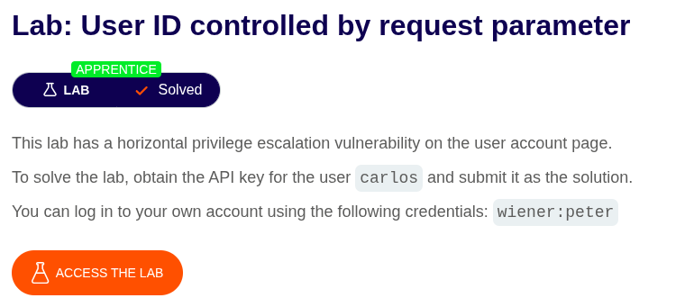
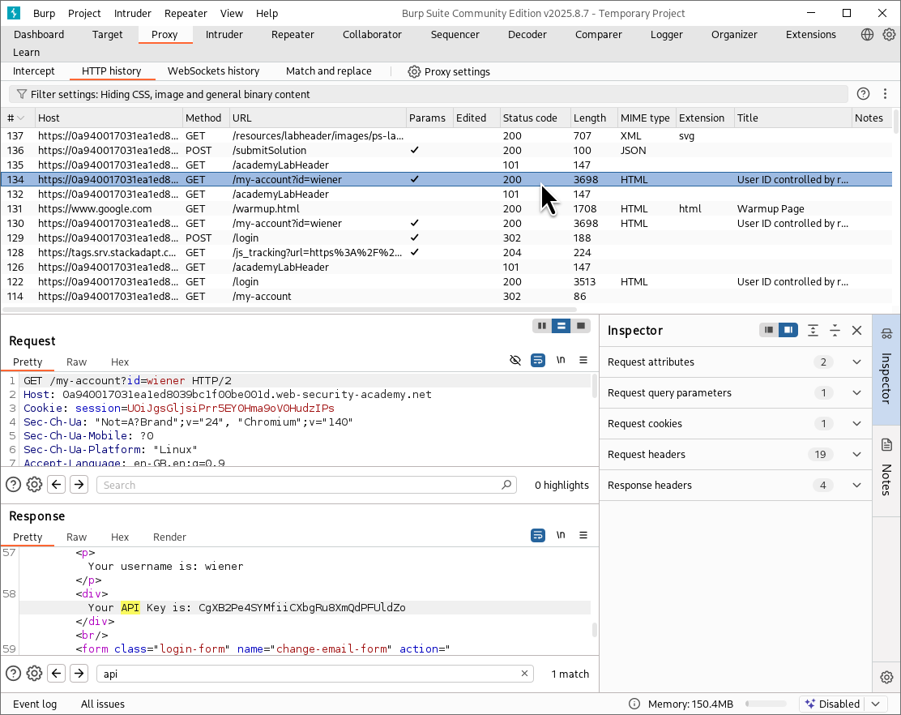
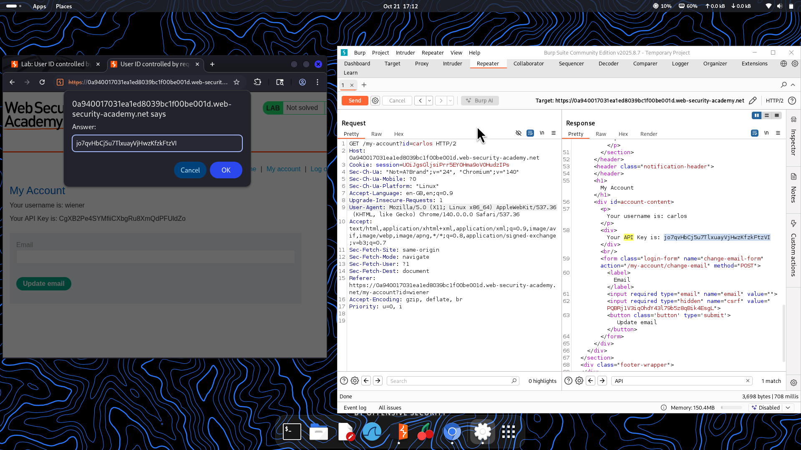

⚠️ **DISCLAIMER / EDUCATIONAL PURPOSES ONLY**  
The information, methodologies, and techniques documented in this write-up are intended solely for educational, training, and authorized security testing purposes. This analysis was conducted within a strictly controlled, legally authorized simulation environment provided by the PortSwigger Web Security Academy. Unauthorized testing, manipulation, or exploitation of live, production web applications without explicit prior consent from the system owner is illegal and punishable under cyber crime laws (including the Information Technology Act in India). The author assumes no liability for the misuse of this information.***  

# Lab Write-Up: User ID Controlled by Request Parameter  

### Portfolio Information  
* **Author:** Ayushma M  
* **Main Repository:** [github.com/ayushmam81-ui/Web-Application-Security-Portfolio](https://github.com/ayushmam81-ui/Web-Application-Security-Portfolio)  
* **Direct File Link:** [labs/idor-lab1.md](https://github.com/ayushmam81-ui/Web-Application-Security-Portfolio/blob/main/labs/idor-lab1.md)  

---

### 1. Target & Scenario  
* **Platform:** PortSwigger Web Security Academy  
* **Vulnerability Class:** Insecure Direct Object References (IDOR)  
* **Objective:** This lab has a horizontal privilege escalation vulnerability on the user account page. To solve the lab, obtain the API key for the user `carlos` and submit it as the solution. You can log in to your own account using the credentials `wiener:peter`.  

---

### 2. Analysis & Methodology  

#### Step 1: Reconnaissance & Interception  
* Logged in using the credentials `wiener:peter` and captured the request to the user account page (`/my-account?id=wiener`) using Burp Suite Proxy.  
* Sent the captured request to the Repeater for further manipulation and testing.  

#### Step 2: Parameter Modification & Exploitation  
* Modified the user identifier parameter in the request from `id=wiener` to `id=carlos` in the Repeater tab.  
* Sent the updated request and successfully bypassed access controls, retrieving the account details and API key for user `carlos` in the response.  

#### Step 3: Solution Submission  
* Copied the exposed API key for `carlos` from the server response.  
* Submitted the retrieved API key into the lab's solution prompt to successfully solve the challenge.  

---

### 3. Visual Evidence  

#### Lab Execution and Output:  
  
*Figure 1: Lab description detailing the objective to retrieve the API key for `carlos`.*  

  
*Figure 2: Intercepting the `/my-account?id=wiener` request in Burp Proxy history.*  

  
*Figure 3: Modifying the user ID parameter in Repeater to `carlos` and submitting the extracted API key to solve the lab.*  

---

### 4. Remediation Strategy  
To secure applications against Insecure Direct Object References (IDOR):  
1. **Server-Side Authorization Checks:** Implement strict authorization controls on the server side to verify that the currently authenticated user session is explicitly permitted to access or modify the requested resource identifier.  
2. **Indirect Reference Maps:** Replace direct, predictable database identifiers or usernames in parameters with randomized, session-mapped reference tokens that cannot be easily guessed or manipulated by users.
