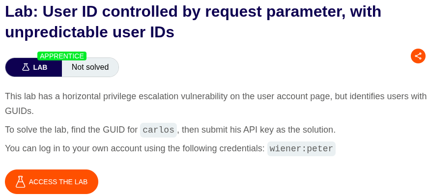
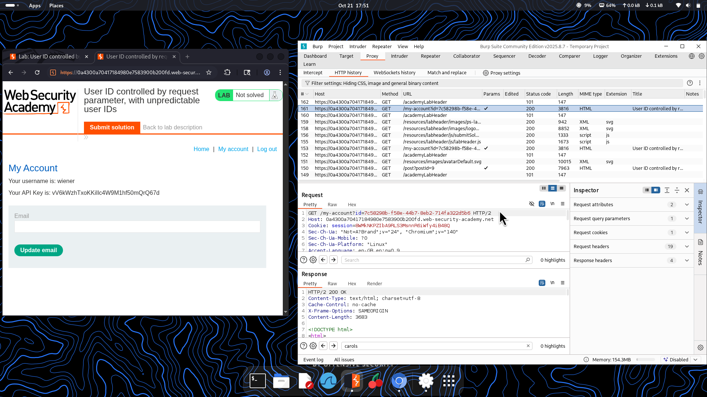
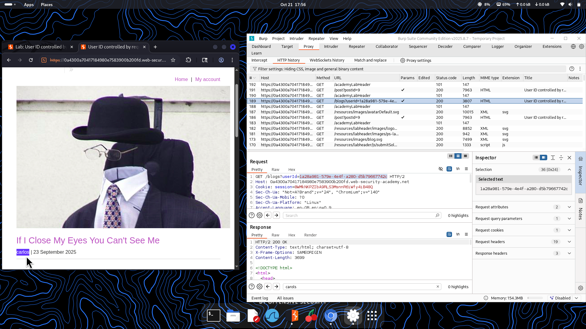
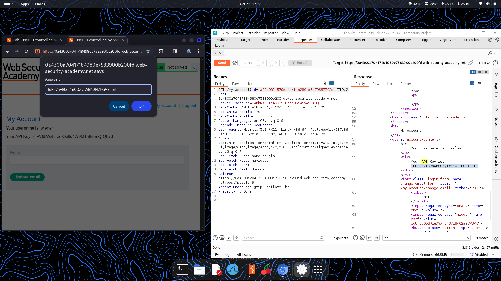

⚠️ **DISCLAIMER / EDUCATIONAL PURPOSES ONLY**  
The information, methodologies, and techniques documented in this write-up are intended solely for educational, training, and authorized security testing purposes. This analysis was conducted within a strictly controlled, legally authorized simulation environment provided by the PortSwigger Web Security Academy. Unauthorized testing, manipulation, or exploitation of live, production web applications without explicit prior consent from the system owner is illegal and punishable under cyber crime laws (including the Information Technology Act in India). The author assumes no liability for the misuse of this information.***  

# Lab Write-Up: User ID Controlled by Request Parameter, with Unpredictable User IDs  

### Portfolio Information  
* **Author:** Ayushma M  
* **Main Repository:** [github.com/ayushmam81-ui/Web-Application-Security-Portfolio](https://github.com/ayushmam81-ui/Web-Application-Security-Portfolio)  
* **Direct File Link:** [labs/idor-lab2.md](https://github.com/ayushmam81-ui/Web-Application-Security-Portfolio/blob/main/labs/idor-lab2.md)  

---

### 1. Target & Scenario  
* **Platform:** PortSwigger Web Security Academy  
* **Vulnerability Class:** Insecure Direct Object References (IDOR)  
* **Objective:** This lab has a horizontal privilege escalation vulnerability on the user account page, but identifies users with unpredictable GUIDs instead of sequential identifiers. To solve the lab, find the GUID for `carlos`, then submit his API key as the solution. You can log in to your own account using the credentials `wiener:peter`.  

---

### 2. Analysis & Methodology  

#### Step 1: Reconnaissance & Initial Request Capture  
* Logged in using the credentials `wiener:peter` and observed that the user account page uses an unpredictable Globally Unique Identifier (GUID) in the request parameter (e.g., `/my-account?id=<GUID>`).  

#### Step 2: Discovering Unpredictable GUIDs  
* Browsed the application and inspected blog posts authored by other users (such as `carlos`). Captured the traffic via Burp Suite Proxy to extract `carlos`'s unique GUID linked within the blog endpoint (`/blogs?userId=<GUID>`).  

#### Step 3: Parameter Substitution & Exploitation  
* Sent the user account request to Burp Repeater, replacing the user's own GUID with the extracted GUID belonging to `carlos`.  
* Sent the modified request and successfully bypassed access controls, retrieving `carlos`'s account profile details and API key in the response body.  

#### Step 4: Solution Submission  
* Copied the exposed API key for `carlos` from the server response and submitted it into the lab's solution prompt to complete the challenge successfully.  

---

### 3. Visual Evidence  

#### Lab Execution and Output:  
  
*Figure 1: Lab description outlining the requirement to locate unpredictable GUIDs for user identification.*  

  
*Figure 2: Inspecting the account endpoint utilizing a GUID format parameter.*  

  
*Figure 3: Finding `carlos`'s GUID by examining the author link parameters in blog post history.*  

  
*Figure 4: Replacing the identifier in Repeater with `carlos`'s GUID to extract the API key and solve the lab.*  

---

### 4. Remediation Strategy  
To secure applications against IDOR vulnerabilities utilizing unpredictable identifiers (GUIDs):  
1. **Robust Access Control Validation:** Do not rely on unguessable identifiers alone as an access control mechanism (security through obscurity). Always verify on the server side whether the authenticated session possesses authorization to view the requested resource.  
2. **Session-Bound Authorization:** Explicitly map requested object identifiers to the user session context to prevent horizontal privilege escalation regardless of whether the identifier format is sequential or a complex GUID.
