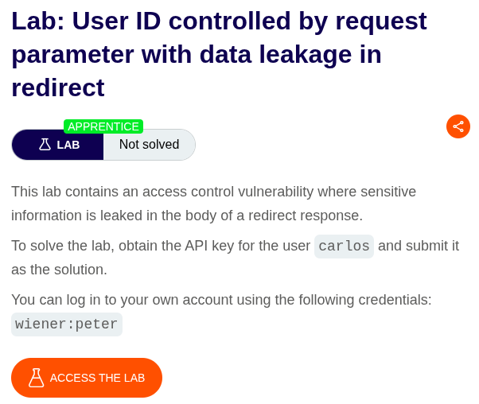
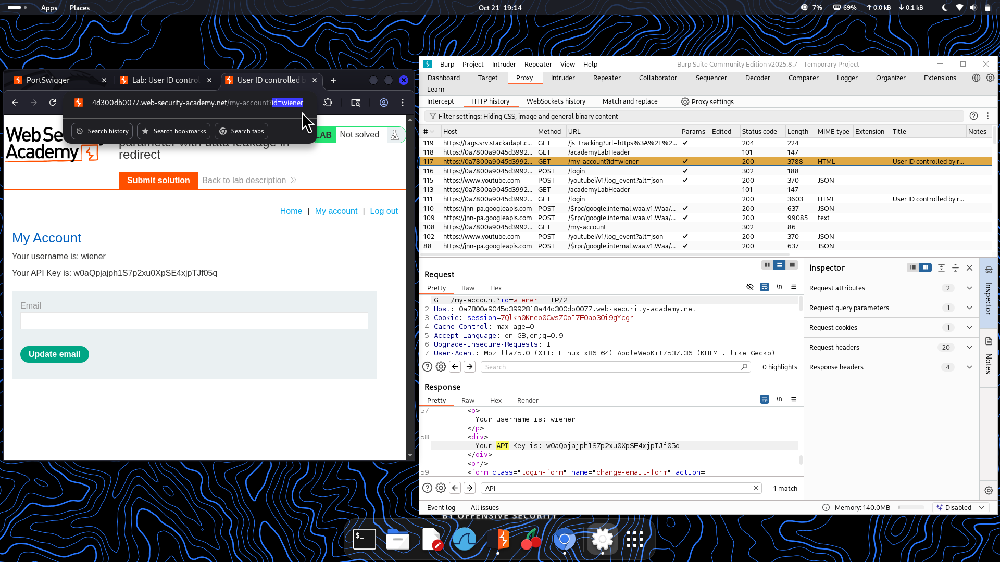
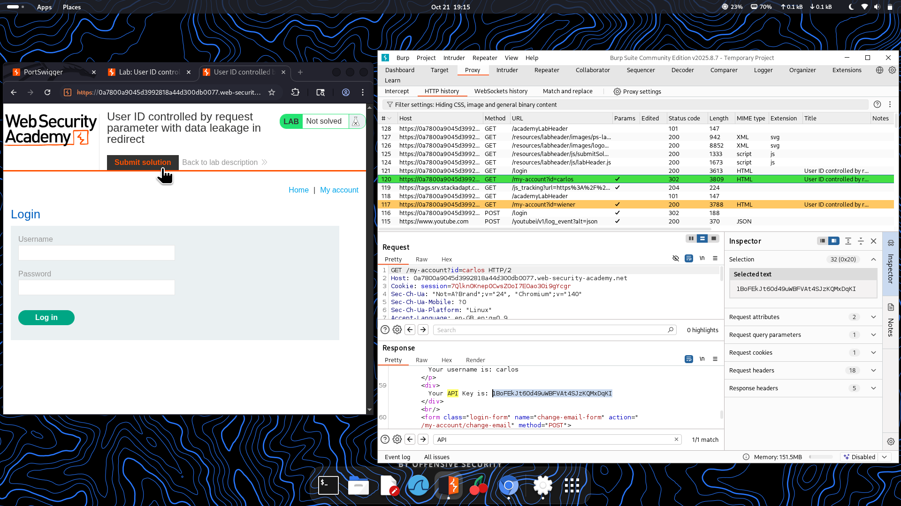

⚠️ **DISCLAIMER / EDUCATIONAL PURPOSES ONLY**  
The information, methodologies, and techniques documented in this write-up are intended solely for educational, training, and authorized security testing purposes. This analysis was conducted within a strictly controlled, legally authorized simulation environment provided by the PortSwigger Web Security Academy. Unauthorized testing, manipulation, or exploitation of live, production web applications without explicit prior consent from the system owner is illegal and punishable under cyber crime laws (including the Information Technology Act in India). The author assumes no liability for the misuse of this information.***  

# Lab Write-Up: User ID Controlled by Request Parameter with Data Leakage in Redirect  

### Portfolio Information  
* **Author:** Ayushma M  
* **Main Repository:** [github.com/ayushmam81-ui/Web-Application-Security-Portfolio](https://github.com/ayushmam81-ui/Web-Application-Security-Portfolio)  
* **Direct File Link:** [labs/idor-lab3.md](https://github.com/ayushmam81-ui/Web-Application-Security-Portfolio/blob/main/labs/idor-lab3.md)  

---

### 1. Target & Scenario  
* **Platform:** PortSwigger Web Security Academy  
* **Vulnerability Class:** Insecure Direct Object References (IDOR) / Data Leakage  
* **Objective:** This lab contains an access control vulnerability where sensitive information is leaked in the body of a redirect response. To solve the lab, obtain the API key for the user `carlos` and submit it as the solution. You can log in to your own account using the credentials `wiener:peter`.  

---

### 2. Analysis & Methodology  

#### Step 1: Reconnaissance & Initial Access  
* Logged into the application using the provided credentials (`wiener:peter`) and observed the user account page URL structure containing the user parameter (`/my-account?id=wiener`).  

#### Step 2: Parameter Modification & Data Leakage Exploitation  
* Modified the account identifier parameter in the URL from `wiener` to `carlos` (`/my-account?id=carlos`).  
* Although the application typically redirects unauthorized users, the response body of the redirect leakage contained the sensitive account details and API key for `carlos`. Captured this interaction via Burp Suite Proxy history.  

#### Step 3: Solution Submission  
* Copied the exposed API key belonging to `carlos` directly from the proxy response body and submitted it into the lab prompt to solve the challenge.  

---

### 3. Visual Evidence  

#### Lab Execution and Output:  
  
*Figure 1: Lab description highlighting data leakage within redirect response bodies.*  

  
*Figure 2: Inspecting the account endpoint and modifying the parameter value to target `carlos`.*  

  
*Figure 3: Extracting `carlos`'s API key from the redirect response body and submitting it to solve the lab.*  

---

### 4. Remediation Strategy  
To secure applications against data leakage in redirects and IDOR vulnerabilities:  
1. **Proper Access Control Enforcement:** Ensure that redirection logic occurs immediately prior to or instead of rendering any sensitive content, preventing protected data from being exposed in response bodies.  
2. **Server-Side Authorization Checks:** Validate user sessions against requested object IDs on every request to ensure proper authorization before returning any response data.
