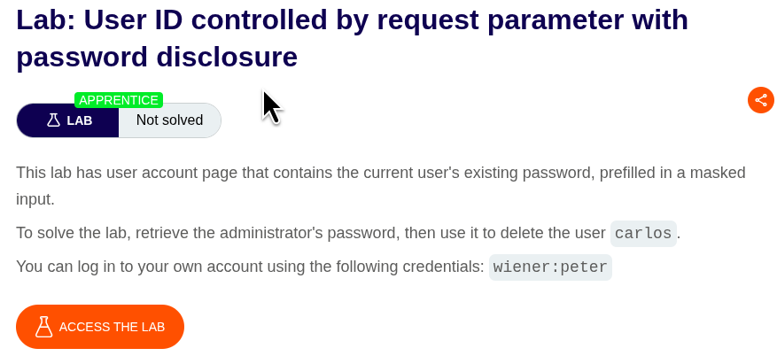
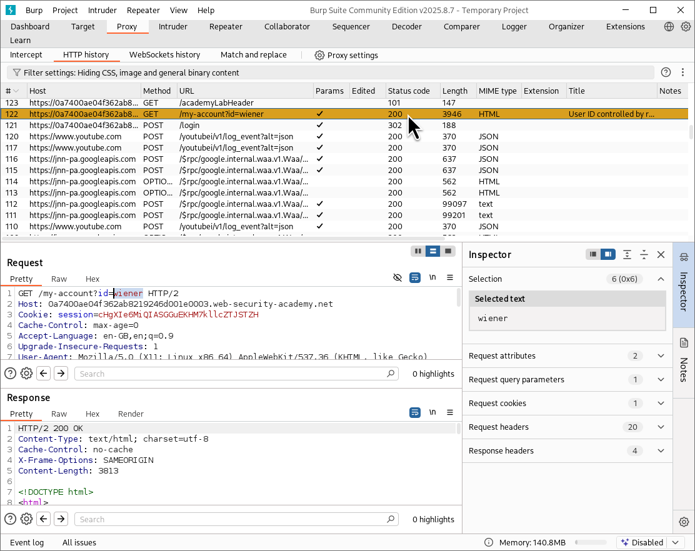
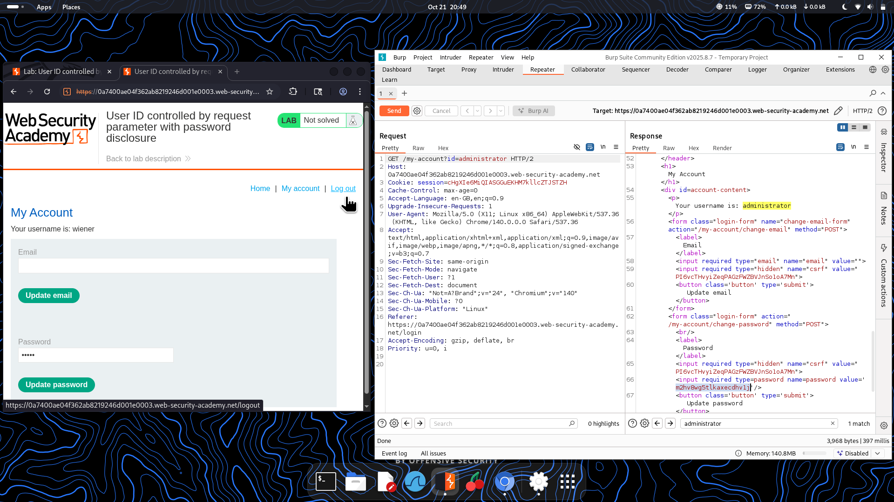
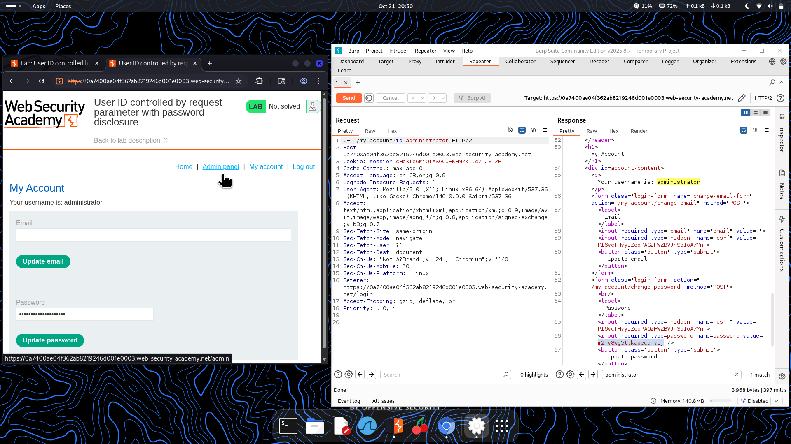

⚠️ **DISCLAIMER / EDUCATIONAL PURPOSES ONLY**  
The information, methodologies, and techniques documented in this write-up are intended solely for educational, training, and authorized security testing purposes. This analysis was conducted within a strictly controlled, legally authorized simulation environment provided by the PortSwigger Web Security Academy. Unauthorized testing, manipulation, or exploitation of live, production web applications without explicit prior consent from the system owner is illegal and punishable under cyber crime laws (including the Information Technology Act in India). The author assumes no liability for the misuse of this information.***  

# Lab Write-Up: User ID Controlled by Request Parameter with Password Disclosure  

### Portfolio Information  
* **Author:** Ayushma M  
* **Main Repository:** [github.com/ayushmam81-ui/Web-Application-Security-Portfolio](https://github.com/ayushmam81-ui/Web-Application-Security-Portfolio)  
* **Direct File Link:** [labs/idor-lab4.md](https://github.com/ayushmam81-ui/Web-Application-Security-Portfolio/blob/main/labs/idor-lab4.md)  

---

### 1. Target & Scenario  
* **Platform:** PortSwigger Web Security Academy  
* **Vulnerability Class:** Insecure Direct Object References (IDOR) / Vertical Privilege Escalation  
* **Objective:** This lab has a user account page that contains the current user's existing password prefilled in a masked input. To solve the lab, retrieve the administrator's password, then use it to delete the user `carlos`. You can log in to your own account using the credentials `wiener:peter`.  

---

### 2. Analysis & Methodology  

#### Step 1: Reconnaissance & Initial Request Capture  
* Logged into the application using the standard user credentials (`wiener:peter`). Captured the HTTP request for the account page via Burp Suite Proxy, noting the user parameter identifier (`/my-account?id=wiener`).  

#### Step 2: Parameter Manipulation & Vertical Escalation  
* Sent the captured request to Burp Repeater and modified the parameter value from `wiener` to `administrator` (`/my-account?id=administrator`).  
* Sent the updated request and inspected the response body, which leaked the administrator account details including the prefilled masked password string.  

#### Step 3: Exploitation and User Deletion  
* Logged out of the standard account and signed back into the application using the username `administrator` alongside the extracted password value.  
* Navigated to the admin panel interface and successfully executed the action to delete the user `carlos` to solve the lab.  

---

### 3. Visual Evidence  

#### Lab Execution and Output:  
  
*Figure 1: Lab description detailing password disclosure via IDOR parameter manipulation.*  

  
*Figure 2: Inspecting the account request containing the `id=wiener` query parameter in Burp Suite.*  

  
*Figure 3: Changing the parameter value to `administrator` in Burp Repeater to retrieve sensitive profile data.*  

  
*Figure 4: Authenticating as the administrator using the leaked password to access the admin panel and delete `carlos`.*  

---

### 4. Remediation Strategy  
To secure applications against password disclosure and vertical IDOR vulnerabilities:  
1. **Strict Server-Side Access Control:** Implement robust authorization checks verifying that the currently authenticated user session is explicitly allowed to view administrative account credentials.  
2. **Avoid Exposing Sensitive Fields:** Refrain from rendering sensitive fields such as plain-text or masked passwords in user profile response bodies, especially when parameterized endpoint inputs can be easily manipulated.
