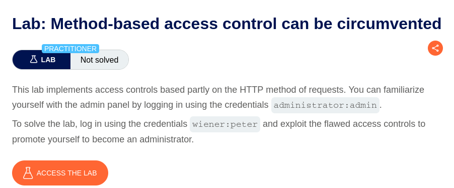
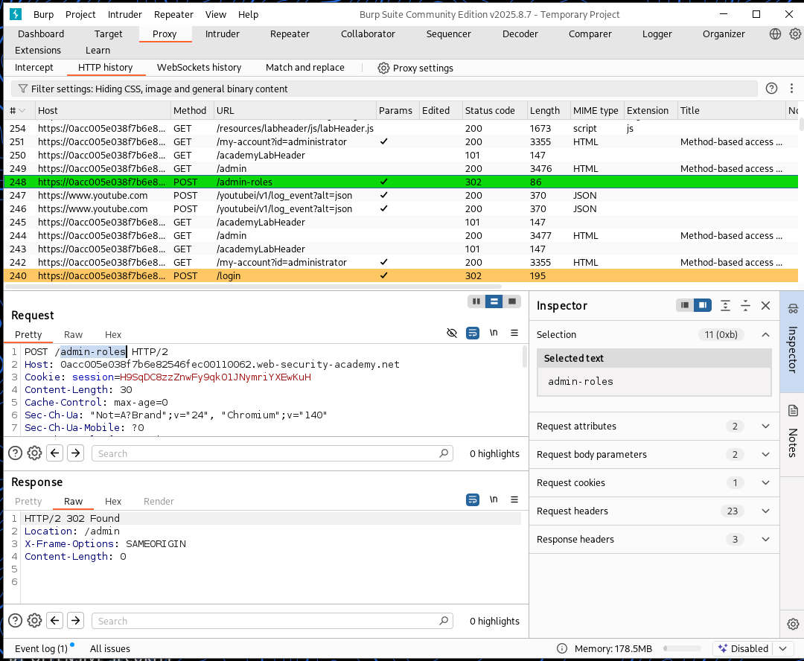
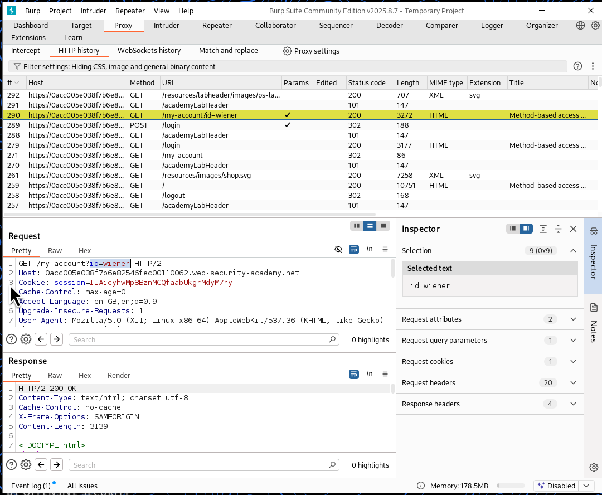
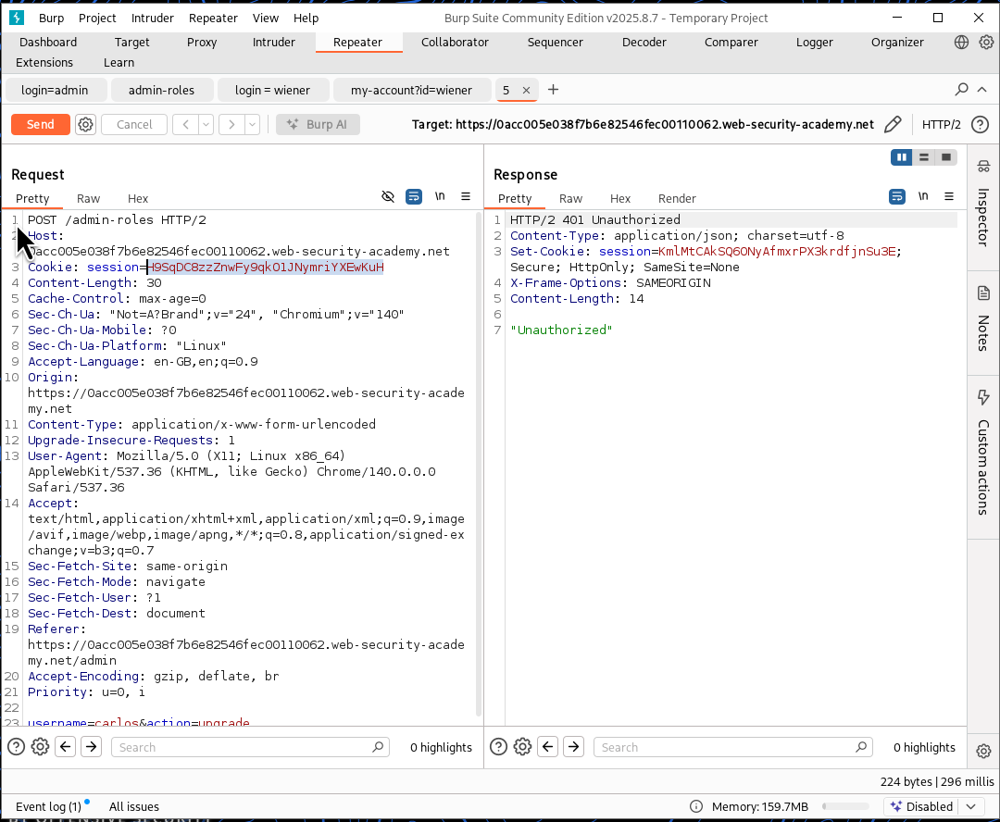
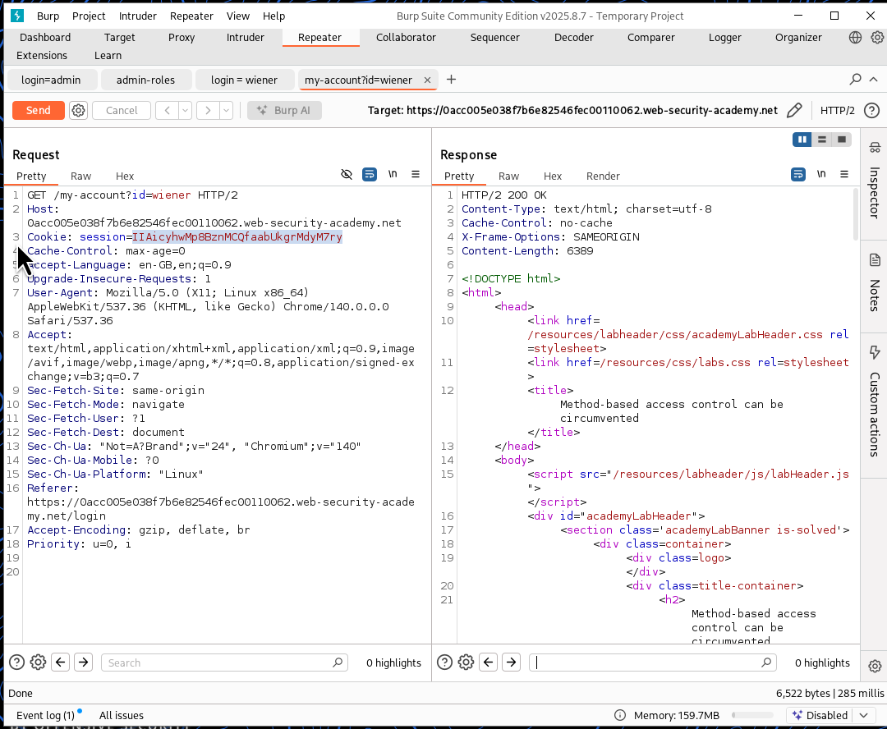
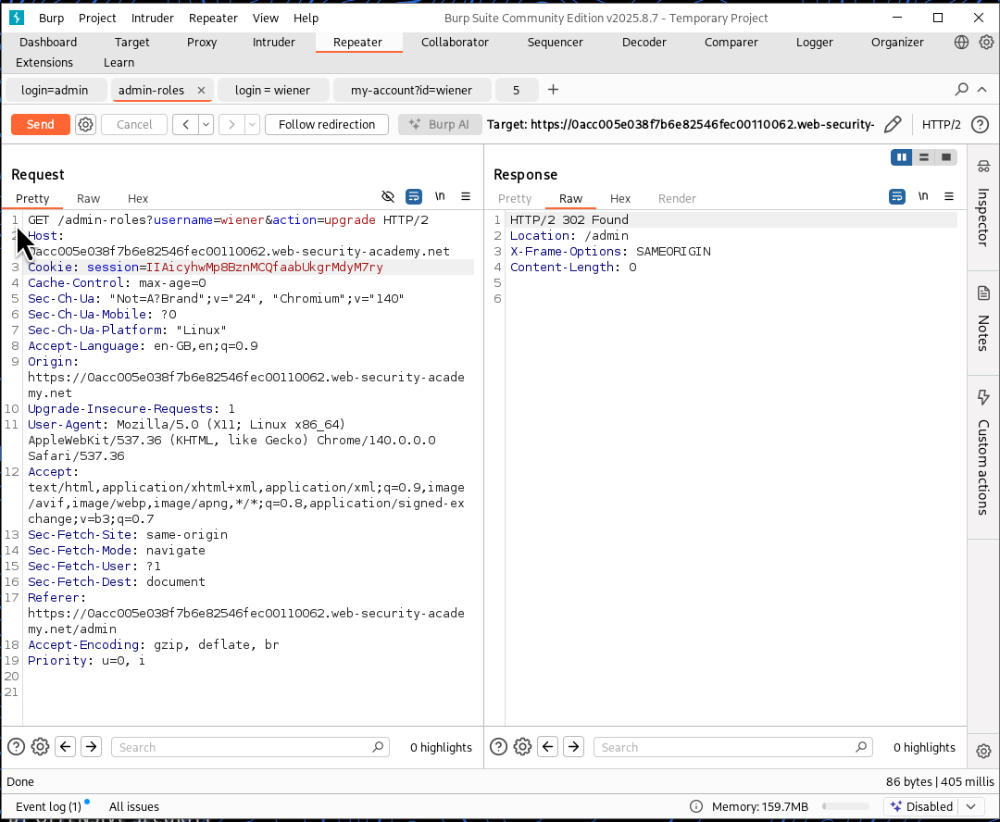

⚠️ **DISCLAIMER / EDUCATIONAL PURPOSES ONLY**
The information, methodologies, and techniques documented in this write-up are intended solely for educational, training, and authorized security testing purposes. This analysis was conducted within a strictly controlled, legally authorized simulation environment provided by the PortSwigger Web Security Academy. Unauthorized testing, manipulation, or exploitation of live, production web applications without explicit prior consent from the system owner is illegal and punishable under cyber crime laws (including the Information Technology Act in India). The author assumes no liability for the misuse of this information.

***

# Lab Write-Up: Method-based Access Control Can Be Circumvented

### Portfolio Information
* **Author:** Ayushma M
* **Main Repository:** [github.com/ayushmam81-ui/Web-Application-Security-Portfolio](https://github.com/ayushmam81-ui/Web-Application-Security-Portfolio)
* **Direct File Link:** [labs/method-based-access-control.md](https://github.com/ayushmam81-ui/Web-Application-Security-Portfolio/blob/main/labs/method-based-access-control.md)

---

### 1. Target & Scenario
* **Platform:** PortSwigger Web Security Academy
* **Vulnerability Class:** Method-based Access Control Flaws
* **Objective:** This lab implements access controls based partly on the HTTP method of requests. You can familiarize yourself with the admin panel by logging in using the credentials `administrator:admin`. To solve the lab, log in using the credentials `wiener:peter` and exploit the flawed access controls to promote yourself to become an administrator.

---

### 2. Analysis & Methodology

#### Step 1: Reconnaissance via Administrator Account
* Logged in using the provided administrative credentials (`administrator:admin`) to examine how the admin panel and role-promotion functions operate.
* Captured the requests from Burp Suite (`/admin-roles` and `/my-account?id=wiener`), sending them to the Repeater for deeper inspection.

#### Step 2: Session Extraction & Request Preparation
* Logged in as the regular user (`wiener:peter`) and captured the session cookie using Burp Proxy (`/my-account?id=wiener` tab in Repeater).
* Analyzed the original `POST /admin-roles` request structure used for privilege promotion before making edits.

#### Step 3: Method Modification & Privilege Escalation
* Switched the request in the Repeater tab from a `POST` method to a `GET` method (`/admin-roles?username=wiener&action=upgrade`).
* Replaced the session cookie with the copied `wiener` session value and sent the modified request, successfully circumventing the method-based restriction and promoting the user account to administrator.

---

### 3. Visual Evidence

#### Lab Execution and Output:

*Figure 1: Lab description demonstrating method-based access control objectives.*

*Figure 2: Burp Suite HTTP history capturing admin actions and role modification requests.*

*Figure 3: Capturing standard user session activity for `wiener` via proxy history.*

*Figure 4: The original `POST /admin-roles` request structure before modification.*

*Figure 5: Extracting the session cookie from the `my-account?id=wiener` tab.*

*Figure 6: Changing the request to a `GET` method with `username=wiener` and the updated session cookie to solve the lab.*

---

### 4. Remediation Strategy
To secure applications against method-based access control bypasses:
1. **Consistent Access Controls:** Ensure that authorization rules are enforced uniformly regardless of the HTTP method (`GET`, `POST`, `PUT`, `DELETE`) used to invoke an administrative endpoint.
2. **Strict Request Validation:** Disallow state-changing actions or administrative privileges from being executed via safe methods like `GET`.
