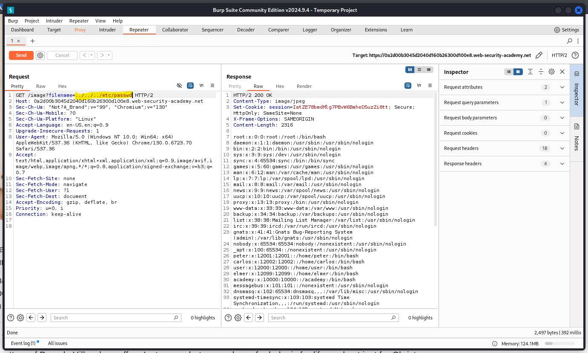

⚠️ **DISCLAIMER / EDUCATIONAL PURPOSES ONLY**
The information, methodologies, and techniques documented in this write-up are intended solely for educational, training, and authorized security testing purposes. This analysis was conducted within a strictly controlled, legally authorized simulation environment provided by the PortSwigger Web Security Academy. Unauthorized testing, manipulation, or exploitation of live, production web applications without explicit prior consent from the system owner is illegal and punishable under cyber crime laws (including the Information Technology Act in India). The author assumes no liability for the misuse of this information.

***

# Lab Write-Up: Reading arbitrary files via path traversal

### Portfolio Information
* **Author:** Ayushma M
* **Main Repository:** [github.com/ayushmam81-ui/Web-Application-Security-Portfolio](https://github.com/ayushmam81-ui/Web-Application-Security-Portfolio)
* **Direct File Link:** [labs/path-traversal-lab1.md](https://github.com/ayushmam81-ui/Web-Application-Security-Portfolio/blob/main/labs/path-traversal-lab1.md)

---

### 1. Target & Scenario
* **Platform:** PortSwigger Web Security Academy
* **Vulnerability Class:** Path Traversal (Directory Traversal)
* **Objective:** Read arbitrary files (specifically `/etc/passwd`) on the server running the application.

---

### 2. Analysis & Methodology

#### Step 1: Initial Assessment & Identification of Constraints
* Identified that images are stored on disk in the location `/var/www/images/`.
* For example, an application loading an image uses HTML like ``, where `218.png` is the file name and the prefix is treated as the base directory path.

#### Step 2: Intercepting and Analyzing the HTTP Traffic
* Captured the request using Burp Suite to analyze how file parameters are passed to the server via `/image?filename=`.
* Recognized that relative paths use sequences like `../` to move upward out of the specific room or directory structure.

#### Step 3: Manipulation & Successful Exploitation
* Modified the `filename` parameter in the request URL using traversal sequences (`../`) to step out of the image directory and access system files.
* Payload used: `/image?filename=../../../etc/passwd`.

---

### 3. Visual Evidence

#### Lab Execution and Output:

*Figure 1: Retrieving the contents of the `/etc/passwd` file via path traversal sequence in Burp Repeater.*

---

### 4. Remediation Strategy
To secure the application against path traversal:
1. **Input Validation:** Validate the user input strictly, ensuring that only expected filenames or alphanumeric characters are accepted.
2. **Use Safe APIs:** Avoid passing raw user input directly to file system APIs. If user input must be mapped to files, use a whitelist approach or map safe identifiers to internal file paths.
