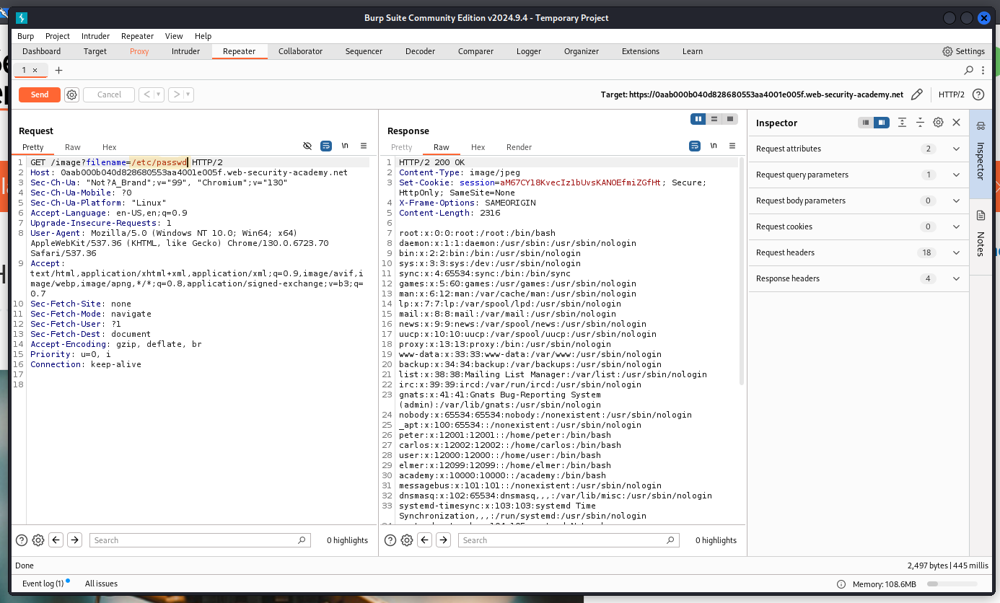

⚠️ **DISCLAIMER / EDUCATIONAL PURPOSES ONLY**
The information, methodologies, and techniques documented in this write-up are intended solely for educational, training, and authorized security testing purposes. This analysis was conducted within a strictly controlled, legally authorized simulation environment provided by the PortSwigger Web Security Academy. Unauthorized testing, manipulation, or exploitation of live, production web applications without explicit prior consent from the system owner is illegal and punishable under cyber crime laws (including the Information Technology Act in India). The author assumes no liability for the misuse of this information.

***

# Lab Write-Up: Path Traversal with Absolute Path Bypass

### Portfolio Information
* **Author:** Ayushma M
* **Main Repository:** [github.com/ayushmam81-ui/Web-Application-Security-Portfolio](https://github.com/ayushmam81-ui/Web-Application-Security-Portfolio)
* **Direct File Link:** [labs/path-traversal-lab2.md](https://github.com/ayushmam81-ui/Web-Application-Security-Portfolio/blob/main/labs/path-traversal-lab2.md)

---

### 1. Target & Scenario
* **Platform:** PortSwigger Web Security Academy
* **Vulnerability Class:** Path Traversal (Directory Traversal)[cite: 2]
* **Objective:** Read arbitrary files on the server when standard relative traversal sequences (`../`) are blocked or modified[cite: 2].

---

### 2. Analysis & Methodology

#### Step 1: Initial Assessment & Identification of Constraints
* Applications often block simple traversal sequences like `../` as a defense mechanism against path traversal vulnerabilities[cite: 2].
* When traversal sequences are stripped or blocked, alternative bypass techniques must be evaluated[cite: 2].

#### Step 2: Intercepting and Analyzing the HTTP Traffic
* Captured the request using Burp Suite to test input parameters handling file paths.
* Identified that absolute paths from the file system root can sometimes be used directly to bypass restrictions[cite: 2].

#### Step 3: Manipulation & Successful Exploitation
* Bypassed the need for relative traversal sequences (`../`) by supplying the absolute path from the root directory[cite: 2].
* Payload used: `/image?filename=/etc/passwd`[cite: 2].

---

### 3. Visual Evidence

#### Lab Execution and Output:

*Figure 1: Successfully reading the `/etc/passwd` file using an absolute file path without traversal sequences.*

---

### 4. Remediation Strategy
To secure the application against absolute path traversal:
1. **Strict Whitelisting:** Implement a strict whitelist of allowed filenames rather than trusting raw file paths or user input.
2. **Path Canonicalization:** Resolve and check canonical paths to ensure that any requested file strictly resides within the intended base directory (`/var/www/images/`)[cite: 2].
