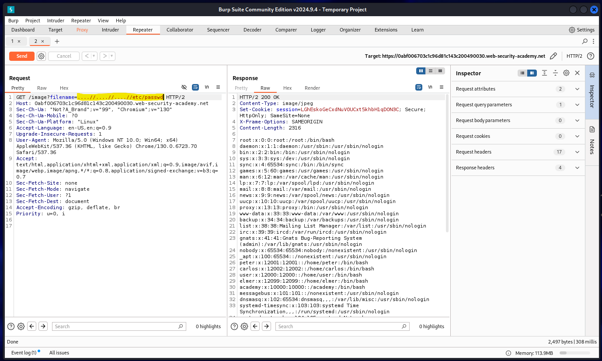

⚠️ **DISCLAIMER / EDUCATIONAL PURPOSES ONLY**
The information, methodologies, and techniques documented in this write-up are intended solely for educational, training, and authorized security testing purposes. This analysis was conducted within a strictly controlled, legally authorized simulation environment provided by the PortSwigger Web Security Academy. Unauthorized testing, manipulation, or exploitation of live, production web applications without explicit prior consent from the system owner is illegal and punishable under cyber crime laws (including the Information Technology Act in India). The author assumes no liability for the misuse of this information.

***

# Lab Write-Up: Path Traversal with Nested Traversal Sequence Bypass

### Portfolio Information
* **Author:** Ayushma M
* **Main Repository:** [github.com/ayushmam81-ui/Web-Application-Security-Portfolio](https://github.com/ayushmam81-ui/Web-Application-Security-Portfolio)
* **Direct File Link:** [labs/path-traversal-lab3.md](https://github.com/ayushmam81-ui/Web-Application-Security-Portfolio/blob/main/labs/path-traversal-lab3.md)

---

### 1. Target & Scenario
* **Platform:** PortSwigger Web Security Academy
* **Vulnerability Class:** Path Traversal (Directory Traversal) with Filters
* **Objective:** Read restricted files when basic traversal sequences are stripped or filtered by utilizing nested traversal sequences.

---

### 2. Analysis & Methodology

#### Step 1: Initial Assessment & Identification of Constraints
* Applications often attempt to block simple traversal attempts by stripping out basic relative sequences (like `../`).
* When a system cleans or filters these inputs by removing inner patterns, it can inadvertently leave behind a functional traversal sequence.

#### Step 2: Intercepting and Analyzing the HTTP Traffic
* Captured the request using Burp Suite to examine how the application processes filtered file parameters.
* Identified that complex or recursive filters can be bypassed using nested sequences.

#### Step 3: Manipulation & Successful Exploitation
* Employed nested traversal sequences such as `....//` or `....\/` as a clever way to sneak past filters.
* When the application strips the inner traversal patterns, the remaining characters form a valid sequence allowing access to restricted system files.

---

### 3. Visual Evidence

#### Lab Execution and Output:

*Figure 1: Executing a nested sequence payload to bypass filters and retrieve target file data.*

---

### 4. Remediation Strategy
To secure the application against nested traversal bypasses:
1. **Recursive Sanitization:** Ensure input filters run iteratively or recursively until no dangerous traversal sequences remain, rather than performing a single-pass strip operation.
2. **Safe Mapping:** Map user input to a safe internal identifier dictionary instead of directly manipulating paths with user-supplied strings.
