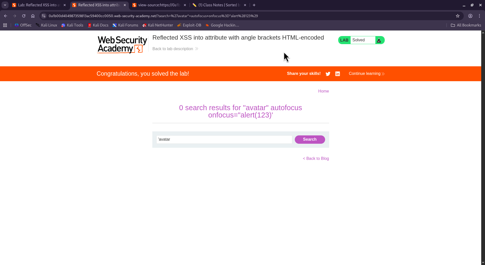

⚠️ **DISCLAIMER / EDUCATIONAL PURPOSES ONLY**
The information, methodologies, and techniques documented in this write-up are intended solely for educational, training, and authorized security testing purposes. This analysis was conducted within a strictly controlled, legally authorized simulation environment provided by the PortSwigger Web Security Academy. Unauthorized testing, manipulation, or exploitation of live, production web applications without explicit prior consent from the system owner is illegal and punishable under cyber crime laws. The author assumes no liability for the misuse of this information.

***

# Lab Write-Up: Reflected XSS into attribute with angle brackets HTML-encoded

### Portfolio Information
* **Author:** Ayushma M
* **Main Repository:** [github.com/ayushmam81-ui/Web-Application-Security-Portfolio](https://github.com/ayushmam81-ui/Web-Application-Security-Portfolio)
* **Direct File Link:** [labs/reflected-xss-attribute-context.md](https://github.com/ayushmam81-ui/Web-Application-Security-Portfolio/blob/main/labs/reflected-xss-attribute-context.md)

---

### 1. Target & Scenario
* **Platform:** PortSwigger Web Security Academy
* **Vulnerability Class:** Reflected Cross-Site Scripting (XSS)
* **Objective:** Perform a cross-site scripting attack that injects an attribute and calls the `alert` function[cite: 4].

---

### 2. Analysis & Methodology

#### Step 1: Initial Assessment
I investigated the search functionality to determine which characters were being sanitized. By testing with an `avatar"` string, I identified that while angle brackets were HTML-encoded, the double-quote (`"`) characters were not[cite: 4].

#### Step 2: Exploitation
Because the application failed to encode double quotes, I was able to break out of the existing attribute context. I injected the following payload into the search bar: `avatar" autofocus onfocus="alert(123)`[cite: 4]. This payload successfully closed the intended attribute, added an `autofocus` attribute, and triggered the `onfocus` event to execute the `alert` function[cite: 4].

---

### 3. Visual Evidence

#### Lab Objective:

*Figure 1: Lab requirements for Reflected XSS into attribute context.*

#### Successful Payload Injection:

*Figure 2: The search results page showing the successful execution of the injected payload.*

---

### 4. Remediation Strategy
To secure this application against attribute-based Reflected XSS:
1. **Context-Aware Encoding:** Ensure that all user input placed within HTML attributes is properly encoded. This includes escaping double quotes (`"`) and single quotes (`'`) to prevent attackers from breaking out of the attribute value context.
2. **Input Validation:** Implement strict validation to ensure that user input does not contain unexpected characters or malicious event handlers that could be interpreted as executable code.
