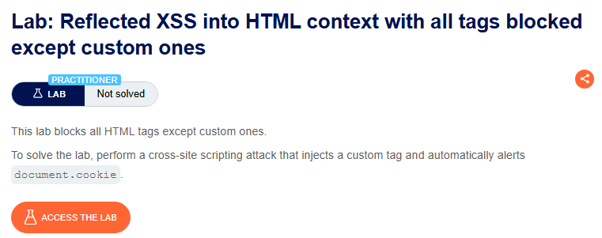

⚠️ **DISCLAIMER / EDUCATIONAL PURPOSES ONLY**
The information, methodologies, and techniques documented in this write-up are intended solely for educational, training, and authorized security testing purposes. This analysis was conducted within a strictly controlled, legally authorized simulation environment provided by the PortSwigger Web Security Academy. Unauthorized testing, manipulation, or exploitation of live, production web applications without explicit prior consent from the system owner is illegal and punishable under cyber crime laws. The author assumes no liability for the misuse of this information.

***

# Lab Write-Up: Reflected XSS into HTML context with all tags blocked except custom ones

### Portfolio Information
* **Author:** Ayushma M
* **Main Repository:** [github.com/ayushmam81-ui/Web-Application-Security-Portfolio](https://github.com/ayushmam81-ui/Web-Application-Security-Portfolio)
* **Direct File Link:** [labs/reflected-xss-custom-tags.md](https://github.com/ayushmam81-ui/Web-Application-Security-Portfolio/blob/main/labs/reflected-xss-custom-tags.md)

---

### 1. Target & Scenario
* **Platform:** PortSwigger Web Security Academy
* **Vulnerability Class:** Reflected Cross-Site Scripting (XSS)
* **Objective:** Perform an XSS attack using a custom tag to automatically alert `document.cookie`[cite: 8].

---

### 2. Analysis & Methodology

#### Step 1: Assessment
The application blocks all standard HTML tags, permitting only custom tags[cite: 8]. To achieve the objective, I utilized an `<iframe>` to host the exploit, as it allowed for the necessary structure to trigger the XSS payload[cite: 8].

#### Step 2: Exploitation
I constructed an `<iframe>` that directs the search feature to execute an `onfocus` event handler on a custom tag element[cite: 8]. The final payload utilized was[cite: 8]:
`<iframe src="https://YOUR-LAB-ID.web-security-academy.net/?search=<catfish+tabindex+1+onfocus=alert(document.cookie)+id=a1>#a1"></iframe>`

By setting `tabindex=1` and appending `#a1` to the URL, the browser automatically focuses on the element with `id=a1`, triggering the `onfocus` event and executing the `alert(document.cookie)` function[cite: 8].

---

### 3. Visual Evidence

#### Lab Objective:

*Figure 1: Lab requirements for utilizing custom tags to trigger XSS.*

---

### 4. Remediation Strategy
1. **Context-Aware Output Encoding:** Always encode data reflected in the browser (e.g., converting `<` to `&lt;`). This prevents the browser from interpreting user input as executable code, regardless of whether the tag is custom or standard.
2. **Content Security Policy (CSP):** Implement a strict CSP to restrict the sources from which scripts can be loaded and executed, effectively mitigating the impact of XSS even if an injection vulnerability exists.
