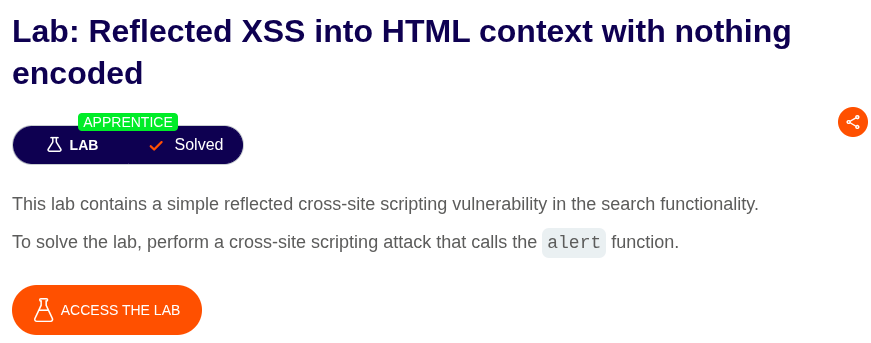
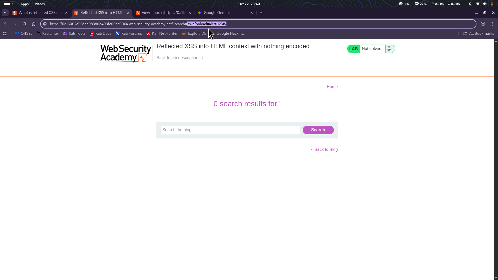

⚠️ **DISCLAIMER / EDUCATIONAL PURPOSES ONLY**
The information, methodologies, and techniques documented in this write-up are intended solely for educational, training, and authorized security testing purposes. This analysis was conducted within a strictly controlled, legally authorized simulation environment provided by the PortSwigger Web Security Academy. Unauthorized testing, manipulation, or exploitation of live, production web applications without explicit prior consent from the system owner is illegal and punishable under cyber crime laws. The author assumes no liability for the misuse of this information.

***

# Lab Write-Up: Reflected XSS into HTML context with nothing encoded

### Portfolio Information
* **Author:** Ayushma M
* **Main Repository:** [github.com/ayushmam81-ui/Web-Application-Security-Portfolio](https://github.com/ayushmam81-ui/Web-Application-Security-Portfolio)
* **Direct File Link:** [labs/reflected-xss-html-context.md](https://github.com/ayushmam81-ui/Web-Application-Security-Portfolio/blob/main/labs/reflected-xss-html-context.md)

---

### 1. Target & Scenario
* **Platform:** PortSwigger Web Security Academy
* **Vulnerability Class:** Reflected Cross-Site Scripting (XSS)
* **Objective:** Perform a cross-site scripting attack that calls the `alert` function[cite: 3].

---

### 2. Analysis & Methodology

#### Step 1: Initial Assessment
I evaluated the search functionality to check for XSS vulnerabilities. I searched for `<gate` to determine how the application handled the `<` character. By inspecting the page source, I confirmed that the application did not encode the `<` character, rendering it vulnerable to injection[cite: 3].

#### Step 2: Exploitation
To solve the lab, I injected the payload `<svg/onload=alert(123)//` directly into the `search` parameter of the URL. Because the application reflects this input back into the page without sanitization, the browser treated the payload as part of the HTML structure and executed the `alert` function immediately[cite: 3].

---

### 3. Visual Evidence

#### Lab Objective:

*Figure 1: Lab requirements for Reflected XSS into HTML context.*

#### Payload Injection:

*Figure 2: Injecting the malicious payload via the URL search parameter.*

---

### 4. Remediation Strategy
To secure this application against Reflected XSS:
1. **Output Encoding:** Implement context-aware output encoding. All user-supplied data must be converted into safe HTML entities before being rendered in the browser.
2. **Input Validation:** While not a complete defense, validating input against a strict allow-list can prevent unauthorized characters from reaching the server[cite: 3].
