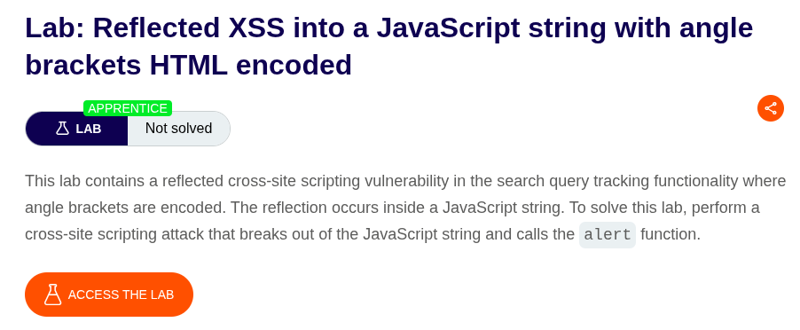
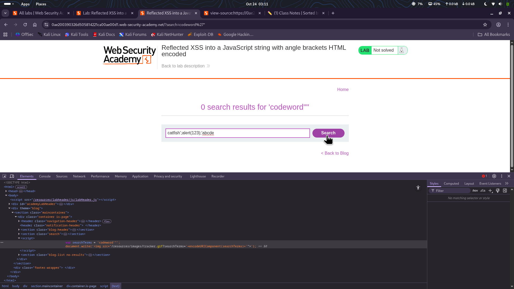

⚠️ **DISCLAIMER / EDUCATIONAL PURPOSES ONLY**
The information, methodologies, and techniques documented in this write-up are intended solely for educational, training, and authorized security testing purposes. This analysis was conducted within a strictly controlled, legally authorized simulation environment provided by the PortSwigger Web Security Academy. Unauthorized testing, manipulation, or exploitation of live, production web applications without explicit prior consent from the system owner is illegal and punishable under cyber crime laws. The author assumes no liability for the misuse of this information.

***

# Lab Write-Up: Reflected XSS into a JavaScript string with angle brackets HTML-encoded

### Portfolio Information
* **Author:** Ayushma M
* **Main Repository:** [github.com/ayushmam81-ui/Web-Application-Security-Portfolio](https://github.com/ayushmam81-ui/Web-Application-Security-Portfolio)
* **Direct File Link:** [labs/reflected-xss-js-string.md](https://github.com/ayushmam81-ui/Web-Application-Security-Portfolio/blob/main/labs/reflected-xss-js-string.md)

---

### 1. Target & Scenario
* **Platform:** PortSwigger Web Security Academy
* **Vulnerability Class:** Reflected Cross-Site Scripting (XSS)
* **Objective:** Break out of a JavaScript string and call the `alert` function[cite: 5].

---

### 2. Analysis & Methodology

#### Step 1: Initial Assessment
I tested the search box to determine how the input was handled within the script[cite: 5].
* Searching for `<codeword` revealed that angle brackets (`<` and `>`) were HTML-encoded[cite: 5].
* Searching for `codeword'" ` confirmed that single quotes (`'`) were not encoded, which indicated an opportunity to escape the JavaScript string context[cite: 5].

#### Step 2: Exploitation
To achieve the objective, I injected the following payload into the search bar: `catfish';alert(123);'abcde`[cite: 5]. The single quotes were used to properly close the existing string, execute the `alert` function, and re-open a dummy string to balance the syntax[cite: 5].

---

### 3. Visual Evidence

#### Lab Objective:

*Figure 1: Lab requirements for breaking out of a JavaScript string.*

#### Successful Payload Injection:

*Figure 2: The injected payload `catfish';alert(123);'abcde` successfully breaking out of the JavaScript string.*

---

### 4. Remediation Strategy
To secure this application against XSS in JavaScript contexts:
1. **Context-Aware Encoding:** When placing user input inside a JavaScript string, use Unicode escapes (e.g., `\u0027` for a single quote) to ensure the data is treated as literal text rather than executable code[cite: 5].
2. **Avoid Direct Placement:** Avoid embedding unsanitized user input directly into JavaScript variables or script blocks. If necessary, pass the data through a secure API or a dedicated data-binding library that handles escaping automatically[cite: 5].
