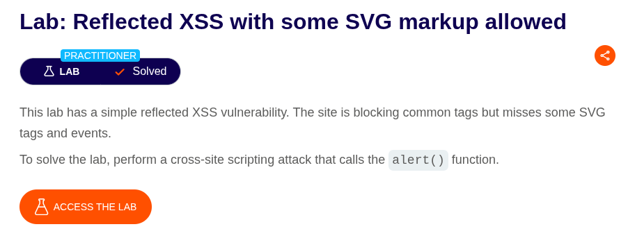
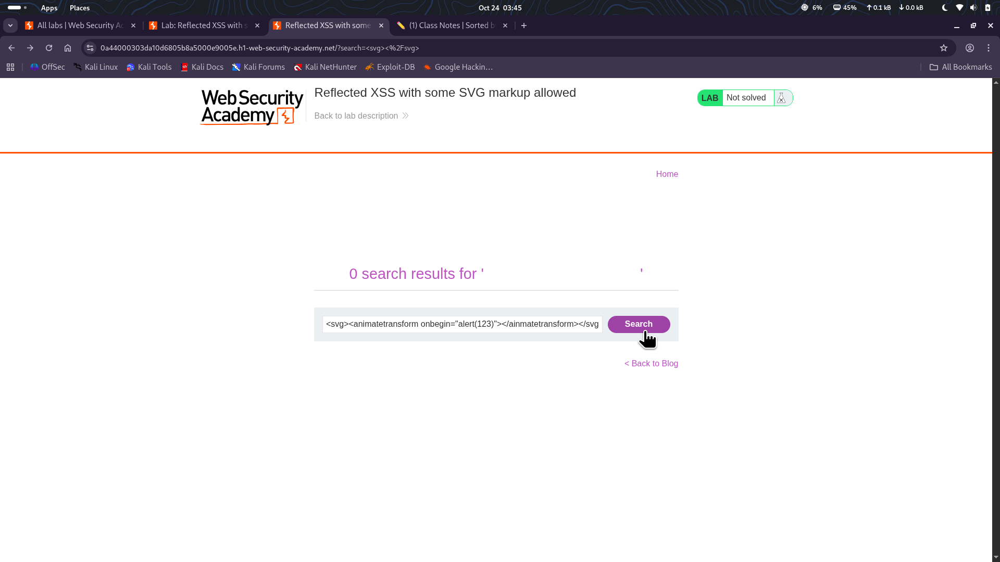

⚠️ **DISCLAIMER / EDUCATIONAL PURPOSES ONLY**
The information, methodologies, and techniques documented in this write-up are intended solely for educational, training, and authorized security testing purposes. This analysis was conducted within a strictly controlled, legally authorized simulation environment provided by the PortSwigger Web Security Academy. Unauthorized testing, manipulation, or exploitation of live, production web applications without explicit prior consent from the system owner is illegal and punishable under cyber crime laws. The author assumes no liability for the misuse of this information.

***

# Lab Write-Up: Reflected XSS with some SVG markup allowed

### Portfolio Information
* **Author:** Ayushma M
* **Main Repository:** [github.com/ayushmam81-ui/Web-Application-Security-Portfolio](https://github.com/ayushmam81-ui/Web-Application-Security-Portfolio)
* **Direct File Link:** [labs/reflected-xss-svg-markup.md](https://github.com/ayushmam81-ui/Web-Application-Security-Portfolio/blob/main/labs/reflected-xss-svg-markup.md)

---

### 1. Target & Scenario
* **Platform:** PortSwigger Web Security Academy
* **Vulnerability Class:** Reflected Cross-Site Scripting (XSS)
* **Objective:** Perform a cross-site scripting attack that calls the `alert()` function[cite: 6].

---

### 2. Analysis & Methodology

#### Step 1: Initial Assessment
I investigated the application's filter mechanism by searching for `<svg></svg>` to determine if SVG tags were permitted[cite: 6]. The test confirmed that these tags were allowed by the application's filter[cite: 6].

#### Step 2: Exploitation
Since SVG markup was not blocked, I utilized an `animatetransform` vector to trigger JavaScript execution[cite: 6]. I injected the following payload into the search bar: `<svg><animatetransform onbegin="alert(123)"></animatetransform></svg>`[cite: 6]. This payload successfully bypassed the filters and executed the `alert()` function when the SVG element initialized[cite: 6].

---

### 3. Visual Evidence

#### Lab Objective:

*Figure 1: Lab requirements for utilizing allowed SVG markup.*

#### Successful Payload Injection:

*Figure 2: The search results page showing the successful execution of the injected SVG payload.*

---

### 4. Remediation Strategy
To secure this application against XSS when handling SVG markup:
1. **Strict Input Sanitization:** Instead of relying on a blocklist of common tags, implement an allow-list approach. Only permit specific, non-executable tags and attributes that are strictly necessary for application functionality.
2. **SVG Sanitization:** If SVG uploads or rendering are required, utilize a specialized library (such as DOMPurify) that is specifically designed to parse and strip malicious scripts, event handlers, and dangerous attributes from SVG markup before it is rendered in the browser.
