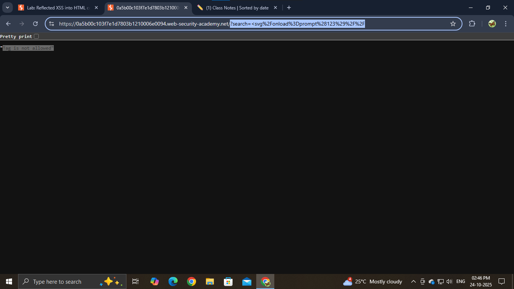
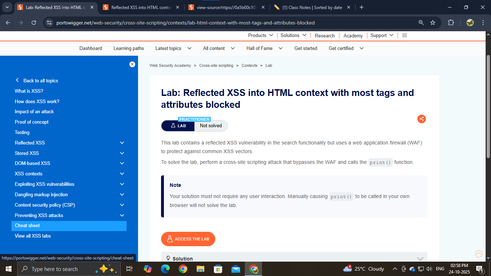
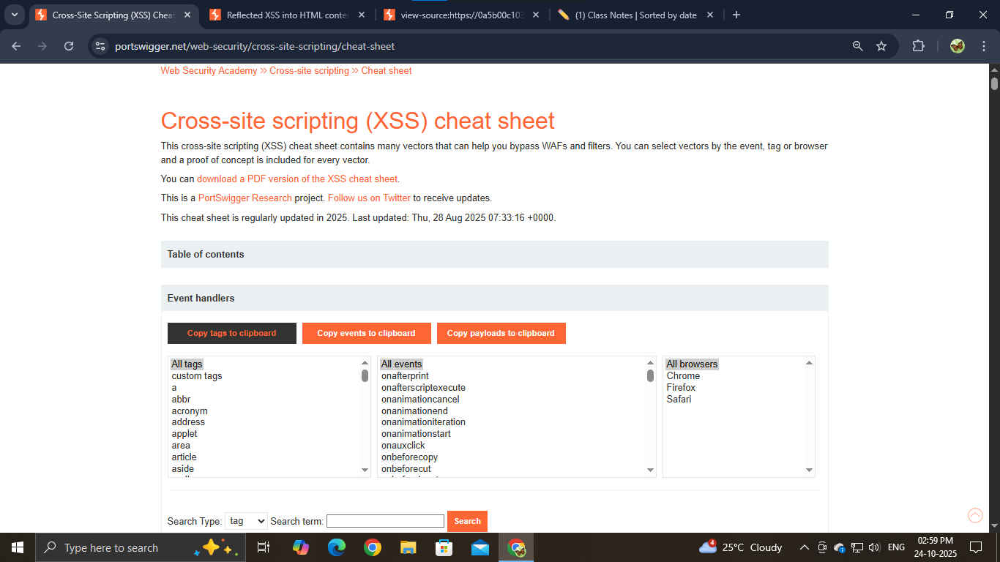
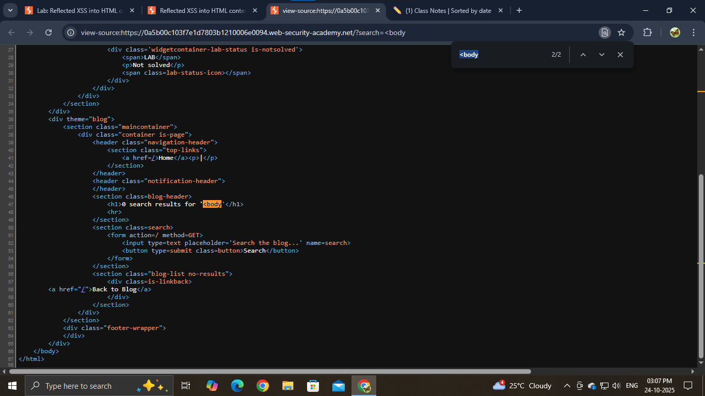
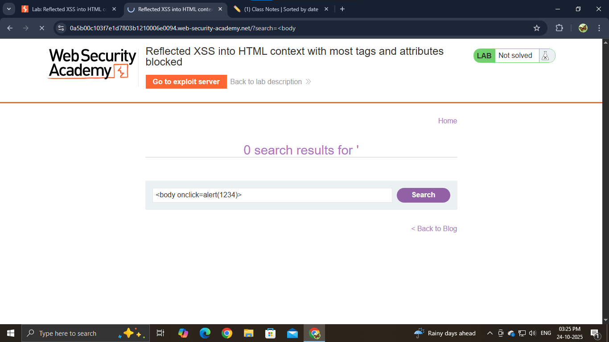

⚠️ **DISCLAIMER / EDUCATIONAL PURPOSES ONLY**
The information, methodologies, and techniques documented in this write-up are intended solely for educational, training, and authorized security testing purposes. This analysis was conducted within a strictly controlled, legally authorized simulation environment provided by the PortSwigger Web Security Academy. Unauthorized testing, manipulation, or exploitation of live, production web applications without explicit prior consent from the system owner is illegal and punishable under cyber crime laws. The author assumes no liability for the misuse of this information.

***

# Lab Write-Up: Reflected XSS into HTML context with most tags and attributes blocked

### Portfolio Information
* **Author:** Ayushma M
* **Main Repository:** [github.com/ayushmam81-ui/Web-Application-Security-Portfolio](https://github.com/ayushmam81-ui/Web-Application-Security-Portfolio)
* **Direct File Link:** [labs/reflected-xss-waf-bypass.md](https://github.com/ayushmam81-ui/Web-Application-Security-Portfolio/blob/main/labs/reflected-xss-waf-bypass.md)

---

### 1. Target & Scenario
* **Platform:** PortSwigger Web Security Academy
* **Vulnerability Class:** Reflected Cross-Site Scripting (XSS)
* **Objective:** Bypass a Web Application Firewall (WAF) to execute the `print()` function[cite: 7].

---

### 2. Analysis & Methodology

#### Step 1: Initial Assessment
I tested the search functionality with `<svg/onload=prompt(123)//` and confirmed that the WAF blocked standard tags like `<svg>`[cite: 7]. Using Burp Suite's Intruder, I performed a fuzzing attack using the PortSwigger XSS Cheat Sheet to identify which tags and attributes were permitted[cite: 7]. The results indicated that only specific custom tags and the `<body>` tag were allowed[cite: 7].

#### Step 2: Exploitation
After confirming the `<body>` tag was not blocked, I used Intruder again to test for allowed event handlers[cite: 7]. I identified that `onbeforeinput`, `onratechange`, and `onresize` were permitted[cite: 7]. Since only one `<body>` tag is allowed in an HTML document, I leveraged the fact that the server effectively merges injected `<body>` attributes into the existing tag[cite: 7]. I successfully triggered the required function by injecting: `<body onbeforeinput="print()">`[cite: 7].

---

### 3. Visual Evidence

#### Lab Objective:

*Figure 1: Lab requirements for WAF bypass.*

#### XSS Cheat Sheet & Intruder:
 
*Figure 2 & 3: Using the XSS cheat sheet and Burp Suite Intruder to identify bypass vectors.*

#### Source Code Verification & Final Payload:
 
*Figure 4 & 5: Confirming tag allowance in source code and executing the successful payload.*

---

### 4. Remediation Strategy
To secure applications protected by WAFs:
1. **Defense in Depth:** WAFs should be a supplementary layer. The primary defense remains strict, context-aware output encoding on the application side to neutralize any input that bypasses the WAF.
2. **Robust Input Filtering:** If a WAF is utilized, ensure it is configured with an updated, comprehensive list of forbidden tags and event handlers, but do not rely on it as the sole mechanism for preventing XSS.
