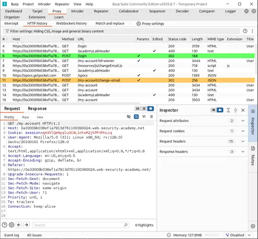
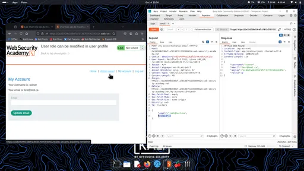
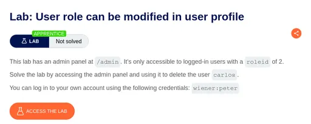

⚠️ **DISCLAIMER / EDUCATIONAL PURPOSES ONLY**
The information, methodologies, and techniques documented in this write-up are intended solely for educational, training, and authorized security testing purposes. This analysis was conducted within a strictly controlled, legally authorized simulation environment provided by the PortSwigger Web Security Academy. Unauthorized testing, manipulation, or exploitation of live, production web applications without explicit prior consent from the system owner is illegal and punishable under cyber crime laws (including the Information Technology Act in India). The author assumes no liability for the misuse of this information.

***

# Lab Write-Up: User Role Modified in User Profile (roleid)

### Portfolio Information
* **Author:** Ayushma M
* **Main Repository:** [github.com/ayushmam81-ui/Web-Application-Security-Portfolio](https://github.com/ayushmam81-ui/Web-Application-Security-Portfolio)
* **Direct File Link:** [labs/roleid-parameter-manipulation.md](https://github.com/ayushmam81-ui/Web-Application-Security-Portfolio/blob/main/labs/roleid-parameter-manipulation.md)

---

### 1. Target & Scenario
* **Platform:** PortSwigger Web Security Academy
* **Vulnerability Class:** Parameter-based Access Control Methods
* **Objective:** This lab has an admin panel at `/admin`. It's only accessible to logged-in users with a `roleid` of `2`. Solve the lab by accessing the admin panel and using it to delete the user `carlos`. You can log in to your own account using the following credentials: `wiener:peter`.

---

### 2. Analysis & Methodology

#### Step 1: Traffic Interception
* Logged in using the credentials (`wiener:peter`) after opening Burp Suite to capture the requests before clicking on login.

#### Step 2: Parameter Modification & Privilege Escalation
* Change the email ID so that we can edit the `roleid` into `2`. Here the `roleid` was `1`; I just edited it on the request side and (after `:` I added a space, because when I didn't add the space it didn't show any response).
* Requests captured by Burp Suite facilitated sending the profile update sequence to the Repeater.

#### Step 3: Execution
* Refreshed the website now you'll find the admin panel and delete `carlos`.

---

### 3. Visual Evidence

#### Lab Execution and Output:

*Figure 1: Requests captured by Burp Suite.*

*Figure 2: Change the email ID so that we can edit the roleid into 2 - Here the “roleid” :2 was “roleid” :1 i just edited it on the request side and (after : i added a space ,because when i didn't add the space it didn't show any response).*

*Figure 3: Question and lab solved by deleting user carlos.*

---

### 4. Remediation Strategy
To secure the application against parameter-based privilege escalation:
1. **Server-Side Role Enforcement:** Maintain user roles and permissions exclusively on the server side within a secure session state, ensuring clients cannot modify parameters like `roleid` during profile updates.
2. **Strict Input Validation & Authorization:** Validate all incoming state-changing parameters against authenticated user privileges before applying modifications to the database.
