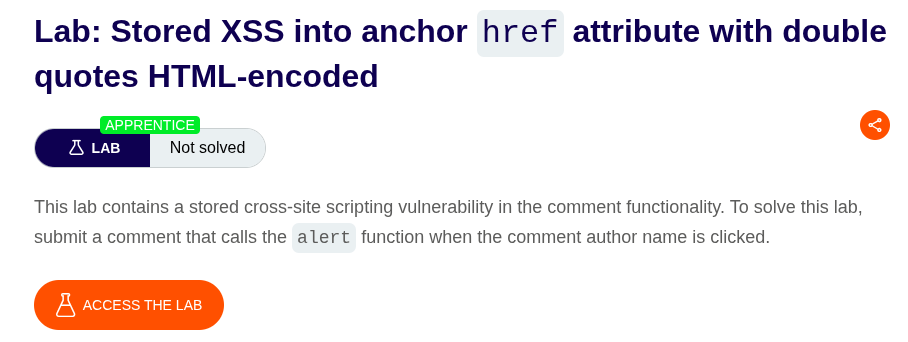
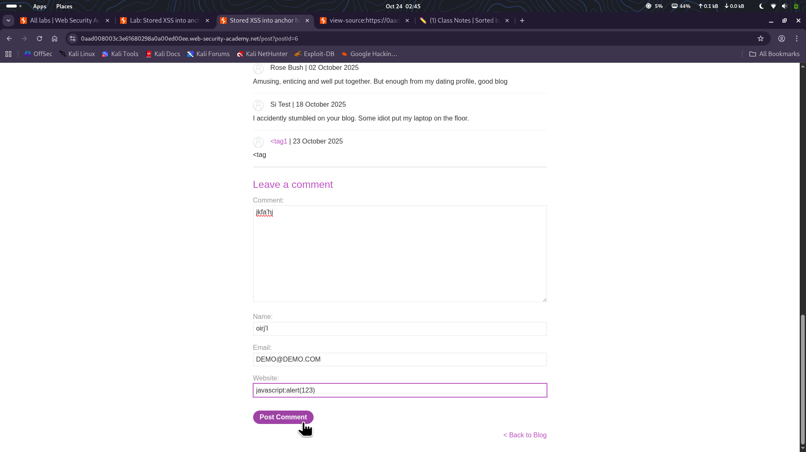

⚠️ **DISCLAIMER / EDUCATIONAL PURPOSES ONLY**
The information, methodologies, and techniques documented in this write-up are intended solely for educational, training, and authorized security testing purposes. This analysis was conducted within a strictly controlled, legally authorized simulation environment provided by the PortSwigger Web Security Academy. Unauthorized testing, manipulation, or exploitation of live, production web applications without explicit prior consent from the system owner is illegal and punishable under cyber crime laws. The author assumes no liability for the misuse of this information.

***

# Lab Write-Up: Stored XSS into anchor href attribute with double quotes HTML-encoded

### Portfolio Information
* **Author:** Ayushma M
* **Main Repository:** [github.com/ayushmam81-ui/Web-Application-Security-Portfolio](https://github.com/ayushmam81-ui/Web-Application-Security-Portfolio)
* **Direct File Link:** [labs/stored-xss-anchor-href.md](https://github.com/ayushmam81-ui/Web-Application-Security-Portfolio/blob/main/labs/stored-xss-anchor-href.md)

---

### 1. Target & Scenario
* **Platform:** PortSwigger Web Security Academy
* **Vulnerability Class:** Stored (Persistent) Cross-Site Scripting (XSS)
* **Objective:** Submit a comment that calls the `alert` function when the comment author's name is clicked[cite: 2].

---

### 2. Analysis & Methodology

#### Step 1: Initial Assessment & Entry Point Testing
I analyzed the comment section to locate vulnerable entry points. I tested the fields (comment, name, email, and website) by injecting test strings like `<test1`, `<test2`, and `<test3`[cite: 2].

#### Step 2: Vulnerability Identification
By inspecting the application's source code, I determined that most entry points were correctly protected by HTML encoding[cite: 2]. However, the "Website" field was identified as the only entry point that remained vulnerable to injection[cite: 2].

#### Step 3: Exploitation
To solve the lab, I injected the payload `javascript:alert(123)` into the "Website" field and populated the remaining fields with dummy data[cite: 2]. Once submitted, clicking the comment author's name triggers the `alert` function, successfully exploiting the stored XSS vulnerability[cite: 2].

---

### 3. Visual Evidence

#### Lab Objective:

*Figure 1: Lab requirements for Stored XSS into anchor href.*

#### Vulnerability Testing:

*Figure 2: Testing input fields to identify the vulnerable website parameter.*

---

### 4. Remediation Strategy
To secure this application against Stored XSS in `href` attributes:
1. **Protocol Validation:** When processing input intended for an `href` attribute, ensure it uses a safe protocol (such as `http:` or `https:`) and strictly block dangerous pseudo-protocols like `javascript:`.
2. **Context-Aware Encoding:** Apply rigorous encoding appropriate for the attribute context. Since the input is placed inside an attribute, ensure that quotes and other special characters are properly escaped to prevent breaking out of the attribute container.
