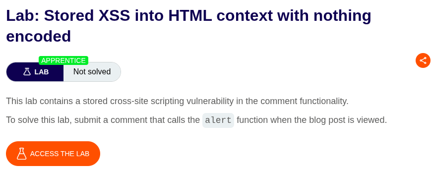
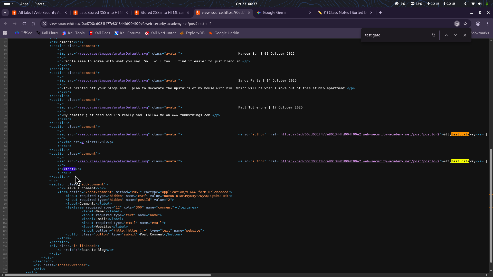
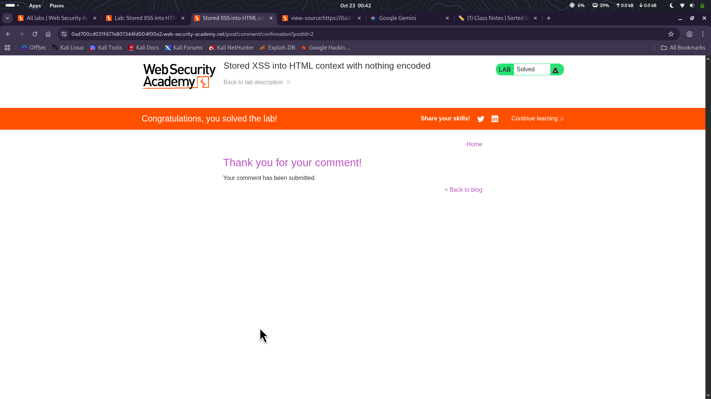

⚠️ **DISCLAIMER / EDUCATIONAL PURPOSES ONLY**
The information, methodologies, and techniques documented in this write-up are intended solely for educational, training, and authorized security testing purposes. This analysis was conducted within a strictly controlled, legally authorized simulation environment provided by the PortSwigger Web Security Academy. Unauthorized testing, manipulation, or exploitation of live, production web applications without explicit prior consent from the system owner is illegal and punishable under cyber crime laws. The author assumes no liability for the misuse of this information.

***

# Lab Write-Up: Stored XSS into HTML context with nothing encoded

### Portfolio Information
* **Author:** Ayushma M
* **Main Repository:** [github.com/ayushmam81-ui/Web-Application-Security-Portfolio](https://github.com/ayushmam81-ui/Web-Application-Security-Portfolio)
* **Direct File Link:** [labs/stored-xss-html-context.md](https://github.com/ayushmam81-ui/Web-Application-Security-Portfolio/blob/main/labs/stored-xss-html-context.md)

---

### 1. Target & Scenario
* **Platform:** PortSwigger Web Security Academy
* **Vulnerability Class:** Stored (Persistent) Cross-Site Scripting (XSS)
* **Objective:** Submit a comment that executes the `alert` function when the blog post is viewed[cite: 1].

---

### 2. Analysis & Methodology

#### Step 1: Initial Assessment & Entry Point Testing
I evaluated the comment section to identify vulnerable input fields. I tested the available entry points (Name, Email, Website, and Comment) by injecting the `<` character[cite: 1]. 

#### Step 2: Vulnerability Identification
By inspecting the source code, I observed that the `<` character was encoded in fields like the "Name" entry point, rendering them secure. However, in the "Comment" input field, the `<` character remained unencoded, confirming that this field was vulnerable to HTML injection[cite: 1].

#### Step 3: Exploitation
To solve the lab, I injected the payload `<svg/onload=alert(123)//` into the comment box and populated the remaining required fields (Name, Email, Website)[cite: 1]. Upon submitting the comment, the malicious script was permanently stored by the server and executed when the page was loaded, successfully triggering the `alert` function[cite: 1].

---

### 3. Visual Evidence

#### Lab Objective:

*Figure 1: Lab requirements for Stored XSS.*

#### Vulnerability Testing:

*Figure 2: Verifying vulnerability by checking if the `<` character is encoded in the source code.*

#### Post-Exploitation Execution:

*Figure 3: The lab confirming successful execution of the alert function.*

---

### 4. Remediation Strategy
To secure this application against Stored XSS:
1. **Output Encoding:** All user-supplied data must be HTML-encoded before being rendered in the browser. This converts special characters (like `<` and `>`) into their safe HTML entity equivalents.
2. **Input Validation:** Implement strict allow-lists for user input to ensure that only expected data formats are accepted by the server.
