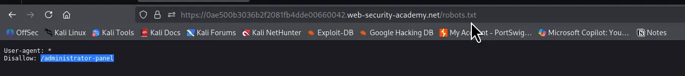
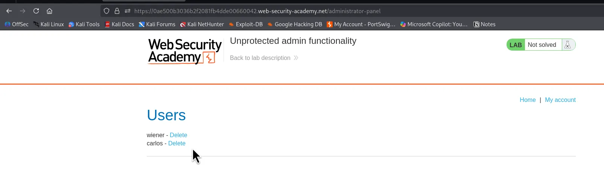
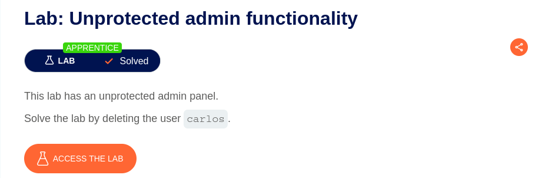

⚠️ **DISCLAIMER / EDUCATIONAL PURPOSES ONLY**
The information, methodologies, and techniques documented in this write-up are intended solely for educational, training, and authorized security testing purposes. This analysis was conducted within a strictly controlled, legally authorized simulation environment provided by the PortSwigger Web Security Academy. Unauthorized testing, manipulation, or exploitation of live, production web applications without explicit prior consent from the system owner is illegal and punishable under cyber crime laws (including the Information Technology Act in India). The author assumes no liability for the misuse of this information.

***

# Lab Write-Up: Unprotected Admin Functionality

### Portfolio Information
* **Author:** Ayushma M
* **Main Repository:** [github.com/ayushmam81-ui/Web-Application-Security-Portfolio](https://github.com/ayushmam81-ui/Web-Application-Security-Portfolio)
* **Direct File Link:** [labs/unprotected-admin-functionality.md](https://github.com/ayushmam81-ui/Web-Application-Security-Portfolio/blob/main/labs/unprotected-admin-functionality.md)

---

### 1. Target & Scenario
* **Platform:** PortSwigger Web Security Academy 
* **Vulnerability Class:** Vertical Access Control / Unprotected Functionality 
* **Objective:** Solve the lab by deleting the user `carlos`.

---

### 2. Analysis & Methodology

#### Step 1: Reconnaissance & Discovery
* Type `/robots.txt` on the URL to know the admin's URL to access admin privileges .
* Discovered an unintended exposure of the administrative path (`/administrator-panel`) within the `robots.txt` file, highlighting a classic security by obscurity flaw .

#### Step 2: Exploitation & Access Control Bypass
* Bypassed perimeter restrictions by navigating directly to the discovered administrative endpoint (`/administrator-panel`) .
* The application loaded the admin dashboard directly without validating backend authorization checks or credentials .

#### Step 3: Execution
* This step shows us that we’ve gained the admin privileges by typing the URL found in the file `/robots.txt`. Located target user `carlos` within the interface and successfully deleted the user to complete the lab objective .

---

### 3. Visual Evidence

#### Lab Execution and Output:

*Figure 1: Type /robots.txt on the URL to know the admins URL to access admin privileges .*

*Figure 2: This step shows us that we’ve gained the admin privileges by typing the URL found in the file /robots.txt .*

*Figure 3: Lab successfully solved by deleting user carlos .*

---

### 4. Remediation Strategy
To secure the application against unprotected admin functionality:
1. **Robust Server-Side Authorization:** Enforce rigorous role-based permission checks on the server side for every administrative endpoint rather than relying on unlinked paths or security by obscurity .
2. **Centralized Access Control:** Implement centralized access control middleware to intercept requests and block unauthenticated or low-privilege users from reaching sensitive controllers.
