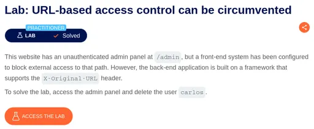
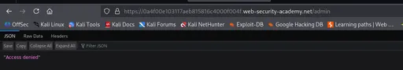
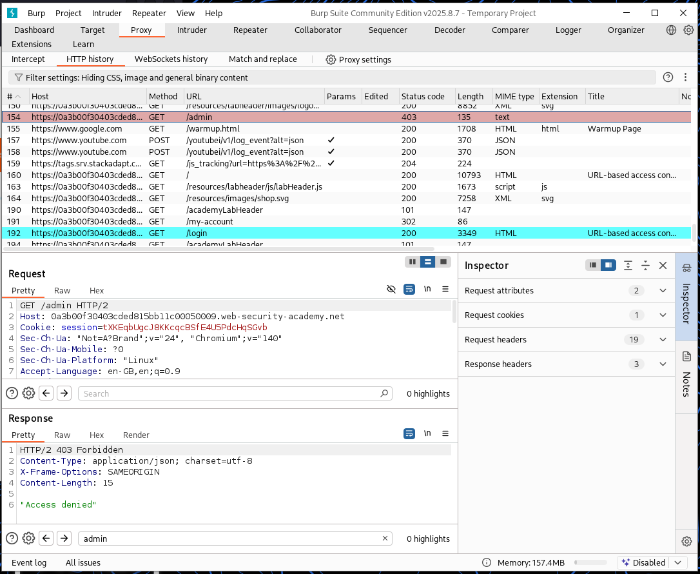
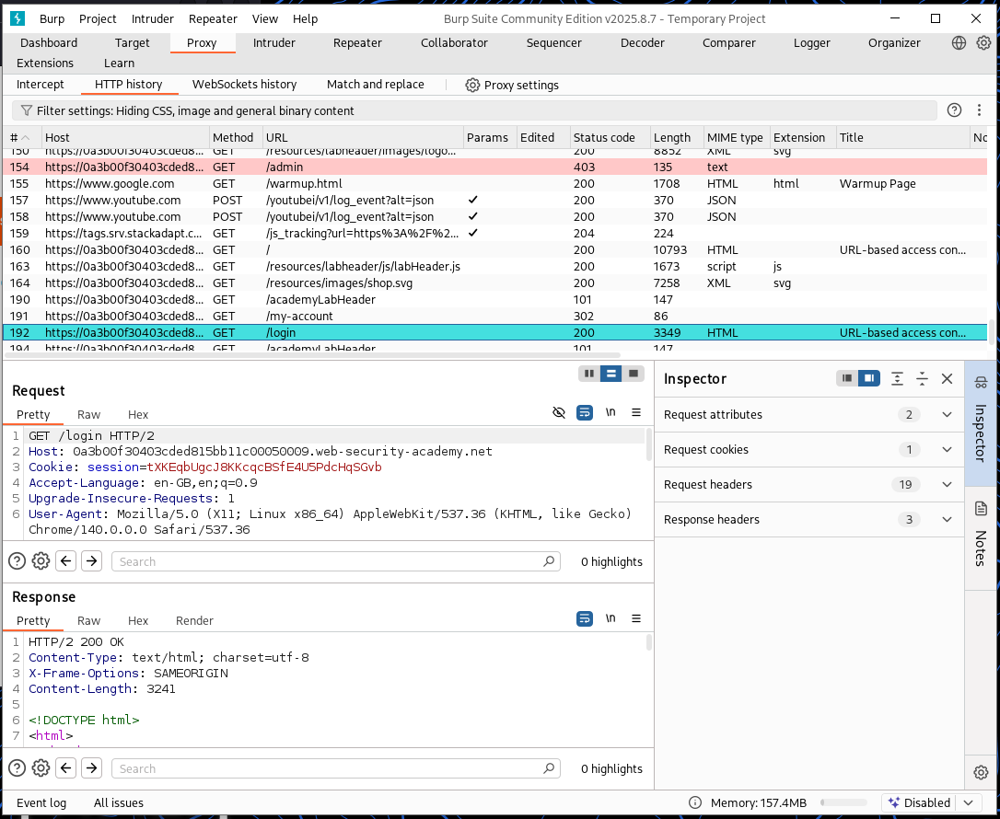
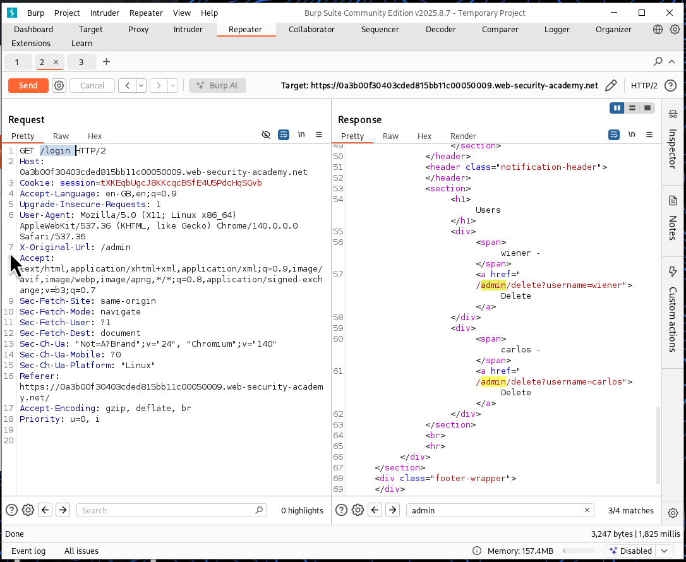
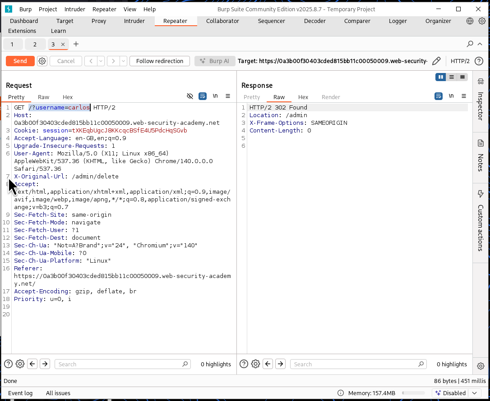

⚠️ **DISCLAIMER / EDUCATIONAL PURPOSES ONLY**
The information, methodologies, and techniques documented in this write-up are intended solely for educational, training, and authorized security testing purposes. This analysis was conducted within a strictly controlled, legally authorized simulation environment provided by the PortSwigger Web Security Academy. Unauthorized testing, manipulation, or exploitation of live, production web applications without explicit prior consent from the system owner is illegal and punishable under cyber crime laws (including the Information Technology Act in India). The author assumes no liability for the misuse of this information.

***

# Lab Write-Up: URL-based Access Control Can Be Circumvented (X-Original-URL)

### Portfolio Information
* **Author:** Ayushma M
* **Main Repository:** [github.com/ayushmam81-ui/Web-Application-Security-Portfolio](https://github.com/ayushmam81-ui/Web-Application-Security-Portfolio)
* **Direct File Link:** [labs/url-based-access-control-x-original-url.md](https://github.com/ayushmam81-ui/Web-Application-Security-Portfolio/blob/main/labs/url-based-access-control-x-original-url.md)

---

### 1. Target & Scenario
* **Platform:** PortSwigger Web Security Academy
* **Vulnerability Class:** Platform Misconfiguration / URL-based Access Control Bypass (X-Original-URL Header)
* **Objective:** This website has an unauthenticated admin panel at `/admin`, but a front-end system has been configured to block external access to that path. However, the back-end application is built on a framework that supports the `X-Original-URL` header. Solve the lab by accessing the admin panel and deleting the user `carlos`.

---

### 2. Analysis & Methodology

#### Step 1: Initial Reconnaissance & Front-End Restriction
* Browsed to the application and attempted to access `/admin` directly, which resulted in a `403 Forbidden` response and an "Access denied" message enforced by the front-end security layer.
* Captured application requests simultaneously using Burp Suite proxy history to analyze traffic patterns between the front door and protected routes.

#### Step 2: Exploiting the `X-Original-URL` Header
* Sent a regular request (such as a login or base path request) to Burp Repeater.
* Added the custom `X-Original-URL: /admin` header into the request and changed the request path to `/` (or `/login`), tricking the front-end into allowing the request through while the back-end processed the overridden path.
* Examined the response, which revealed the underlying admin panel content containing deletion links, specifically `/admin/delete?username=carlos`.

#### Step 3: Execution & User Deletion
* Modified the Repeater request line to `GET /?username=carlos` and set the header to `X-Original-URL: /admin/delete` to target the deletion route directly.
* Sent the request, verifying that the back-end framework processed the overridden route, successfully executing the deletion of user `carlos` and solving the lab.

---

### 3. Visual Evidence

#### Lab Execution and Output:

*Figure 1: Lab description showing objective to bypass URL-based access controls using `X-Original-URL`.*

*Figure 2: When clicked on the admin panel, access is denied with a 403 status code.*

*Figure 3: Burp Suite HTTP history capturing the blocked `/admin` request.*

*Figure 4: Capturing standard application requests sent to the proxy simultaneously.*

*Figure 5: Using `X-Original-URL: /admin` in Repeater to retrieve internal admin dashboard options.*

*Figure 6: Overriding the URL via `X-Original-URL: /admin/delete` to successfully delete user `carlos`.*

---

### 4. Remediation Strategy
To secure applications against URL-override and edge-routing misconfigurations:
1. **Enforce Edge-to-Core Consistency:** Ensure that authorization decisions are applied uniformly across both edge proxy/front-end systems and internal backend routing layers.
2. **Disable URL-Override Headers:** Explicitly disable support for custom override headers like `X-Original-URL` and `X-Rewrite-URL` unless strictly required, and never trust client-supplied headers to redefine core routing semantics.
